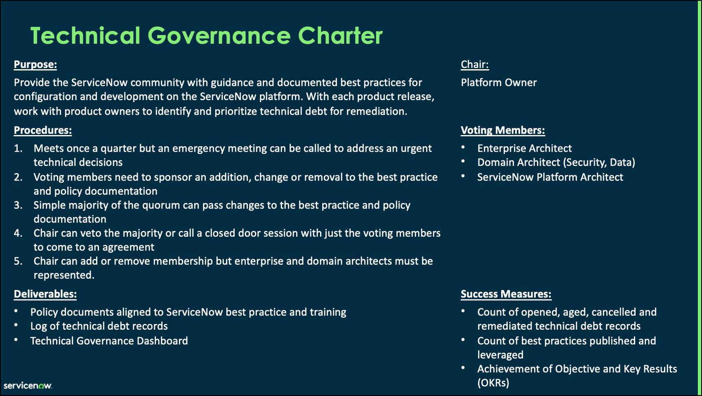
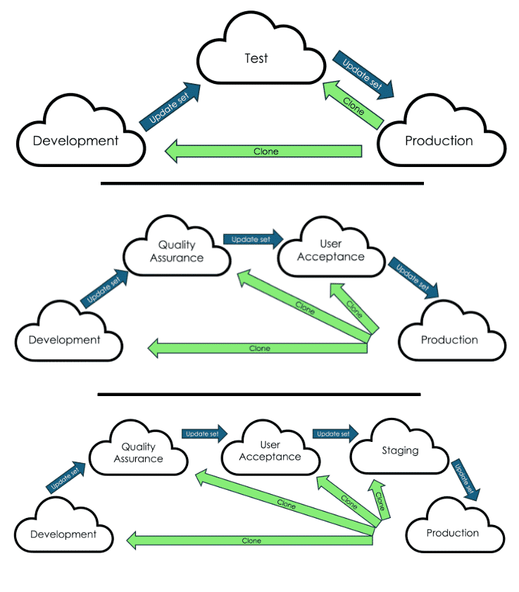

# Week 3 - Notizen

<!-- Technical Governance -->

- Governance = decision-making framework: defines how ServiceNow strategy, portfolio, and technical decisions are made, and who has authority to make them
- Not an operating model (operating model = how products/services reach consumers) — governance is foundational to growing and scaling an enterprise platform

**Why invest in governance?**
- Drives transformation vision: aligns investments and initiatives with strategic goals, ensures appropriate resource allocation
- Delivers the right work at the right time: clear roles/responsibilities reduce roadblocks, enable faster decision-making
- Maintains implementation integrity: provides guidelines, standards, and leading practices — data handled appropriately, systems secure, services reliable

**Governance key players**
- Start by designating someone (usually the platform owner) to design and implement the governance approach — define scope, goals, and identify right stakeholders

**Executive Sponsor**
- Chairs the Executive Steering Committee
- Sets platform vision, ensures initiatives align with organizational goals
- Champions platform adoption by leaders and business functions
- Secures executive buy-in and funding

**Platform Owner**
- May chair or co-chair the technical governance board
- Accountable for the ServiceNow strategic roadmap aligned with business objectives
- Establishes and enforces governance policies for platform consistency
- Ensures adherence to best practices, security standards, and compliance

**Platform Architect**
- May chair or co-chair the technical governance board
- Establishes best practices for data modelling, integrations, and configurations
- Establishes governance policies to minimize unnecessary technical debt

**Demand Manager**
- Chairs the demand governance board
- Accountable for demand prioritization aligned with platform strategy and business outcomes
- Works with stakeholders to prioritize demands based on value, urgency, and resources

**Process Owner**
- Defines and documents best practices, workflows, and policies for their respective process
- Collaborates with the Demand Manager to prioritize process-related enhancements
- Reviews and approves enhancements, automation, or changes to the process in ServiceNow

**Developer / Administrator**
- Works with Demand Manager, Process Owners, and Platform Architect to assess impact of changes
- Documents configurations, scripts, and solutions to support ongoing governance
- Ensures all changes go through proper change control and governance processes

> **Quiz**
> **Q:** Governance is a decision-making framework that accelerates outcomes by defining which of the following? Select all that apply.
> **Options:**
> - What decisions need to be made and when
> - Who is involved in decision-making
> - How the work gets done
> - How decisions are made
> **Correct:** What decisions need to be made and when, Who is involved in decision-making, How decisions are made
> **Erklärung:** Organizations accelerate outcomes by defining what decisions need to be made and when, who is involved, and how decisions are made. "How the work gets done" is not part of the governance framework — that belongs to the operating model.

**Governance boards**

- Three boards: Executive Steering Board (strategic), Demand Board (portfolio), Technical Governance Board (technical)
- Flow: Executive Steering Board sends strategic/guiding principles down to Demand Board; Demand Board sends demand for assessment to Technical Governance Board; Technical Governance Board returns solution/design/impact/effort; Operations CAB handles implementation

**Executive Steering Board**
- Senior IT and business leaders; addresses strategy questions
- Decides strategic vision, oversees budget/resources, makes final roadmap decisions
- Defines how strategy roadmap decisions align ServiceNow functionality to business outcomes

**Demand Board**
- Platform and process owners; addresses portfolio questions
- Scopes work, creates roadmap aligned with executive steering board vision

**Technical Governance Board**
- IT leaders and architects; addresses technical questions
- Sets standards and guardrails for Now Platform development to minimize technical risk

**Online Ressources**

- Planning templates available for establishing governance boards (e.g. Technical Governance Foundation Template) — help structure definitions and ensure consistency
  - Resource: https://learning.servicenow.com/nowcreate/en/pages/assets?id=nc_asset&asset_id=5cbdc1b187709518f2f443f7dabb356f&nc_source=copy_asset_link

**Governance boards — example (bank AI app)**
- Executive Steering Board: sets strategic direction — AI-powered financial planning app aligns with digital transformation and customer experience goals
- Demand Board: assigns resources and delivery timelines for the app, balances against other digital projects, reprioritizes lower-impact work to fast-track
- Technical Governance Board: validates technical feasibility, legacy system integration, security and compliance
- Key: strategic roadmap (ESB) informs timing/resourcing at portfolio level (Demand Board), guided by technical priorities (TGB) — separate expertise per level, but open communication required to prevent siloed decisions

**Technical Governance Board — CTA role**
- Help outline the board's charter, scope, roles, and responsibilities
- Provide expertise on platform architecture, scalability, and maintainability best practices
- Help define coding standards, development guidelines, and security policies
- Align governance with latest ServiceNow platform capabilities
- Identify strategies for addressing technical debt, legacy issues, and inefficiencies

> **Quiz**
> **Q:** Which of the following are key components of the governance framework recommended by ServiceNow? Select all that apply.
> **Options:**
> - Technical governance board
> - Executive steering board
> - Demand board
> - Portfolio governance board
> - Operational oversight board
> - Governance coordination forum
> **Correct:** Technical governance board, Executive steering board, Demand board
> **Erklärung:** The ServiceNow governance framework consists of exactly three boards: Executive Steering Board (strategy), Demand Board (portfolio), and Technical Governance Board (technical). Portfolio governance board, Operational oversight board, and Governance coordination forum are not part of this framework.

**Technical governance domains**
- TGB oversees four domains of technical governance policies and standards:
  1. Data Management
  2. Environment Management
  3. App Dev Management
  4. Platform Management

**Data Management**

- Data ownership:
  - Data owners responsible for accuracy and management of data in ServiceNow; must have authority to enforce data policies across the org
  - Collaborate with business and process owners to determine data needs and usage
  - Assign data stewards/custodians to improve compliance with policies and standards
  - Use ServiceNow dashboards to monitor data quality and completeness
  - Reference: [Define ServiceNow Data Governance](https://learning.servicenow.com) — 8 types of data with recommended owners

- Data quality:
  - Clean data is critical for accurate analysis and informed decision-making
  - Tools: Discovery, Service Mapping, Identification and Reconciliation Engine — maintain accurate CMDB data, prevent inconsistencies
  - Production instance = single source of truth; use cloning or IDR to maintain data integrity across instances

- Data security:
  - ServiceNow security measures: authentication, RBAC, encryption
  - Regulated industries may require additional safeguards
  - Different data types (PII, asset data, application data) may have specific security requirements

- Data integrations:
  - Integrations can involve processes, data, or UI
  - Prioritize data that supports workflows and drives business outcomes
  - Start with pre-built integrations (ServiceNow Store) before custom solutions
  - Integration Hub: low-code, build custom spokes for external integrations

**Environment Management**

Environment management is covered in detail in the Instance and Release Strategy: Part 1 module. Instance structure defines your ServiceNow environment setup and support model. It is the foundational component of environment governance.

- The instance structure informs how all environment-related policies and standards should be defined
- It also maintains the high-level requirements for each instance
- As you define the instance structure, you should consider items such as the development process standards set by the organization, compliance and regulatory concerns, the effort involved in keeping instances in sync, and the number of development teams working with ServiceNow applications
- Define instance structure early on; this should ideally happen in an early pre-sales engagement with ServiceNow

**Application Development Management**

**Customization & configuration guidelines**
> **Governance policies define standards for application development**
> **Custom development only when configuration cannot meet business needs; must follow recommended tools and best practices**
> **Policies should be reviewed and communicated frequently to all stakeholders, admins, and developers**
> **Goals: increase customer value, decrease technical debt, improve performance, set scalable and durable solution**
> **Key decision question: does the business value of customization outweigh the risk (technical debt, upgradeability)?**

> **Consistent naming conventions required across all artifacts (update sets, script includes, business rules, client scripts, workflows, tables) — update sets should be identified by their corresponding user story**

> **ServiceNow Developer Technical Best Practices: https://developer.servicenow.com/dev.do#!/guides/quebec/now-platform/tpb-guide/scripting_technical_best_practices**

**Platform Management**

When defining access policies consider the following:

- Which users should have access to the instance?
- What level of access should users have within the instance?
- What is the process for requesting access?
- What training and/or certification is required to obtain access?
- Who is responsible for approving access?

Other policies to consider:

- Access levels: defines who has what level of access to specific parts of the platform and which instances
- Now Support: defines who has access to the Now customer support instance
- Temporary access: defines how people can obtain temporary access to the platform to fulfill a specific job

**Upgrade management and patching**
- Defines process and standards for upgrading efficiently; goal is to stay current with latest releases
- ServiceNow leading practice: upgrade at least once per year; many customers target every new release
- Benefits: continued SN support, access to new OOTB functionality

Upgrade management policy areas:

- Process: What does the upgrade process flow look like? Who should be involved and in what phases? When will each environment be upgraded? What is the process to evaluate and/or remediate skipped items during the upgrade?
- Approvals: What approvals need to take place before / during / after the upgrade?
- Testing: What testing needs to occur before the upgrade? What testing needs to occur after the upgrade?
- Scheduling: What maintenance windows apply to upgrades? What blackout windows apply to upgrades?
- Communications: What communications need to occur before / during / after the upgrade?
- Support: What is the support process to handle issues during upgrades? When is ServiceNow Support engaged, if necessary?

- Resource — Skipped changes review: https://www.servicenow.com/content/dam/servicenow-assets/public/en-us/doc-type/success/quick-answer/skipped-changes-review.pdf

**Performance monitoring and readiness**

Policies regarding performance monitoring and readiness describe the instance hygiene activities that administrators should perform on a routine basis to monitor and maintain the overall health of their ServiceNow instance(s). These activities should be identified by the frequency at which they are performed: daily, weekly, monthly, quarterly.

When defining policies, consider including these activities and establish a process to handle discrepancies when they are found.

**Governance golden rules**

Many organizations begin by defining a set of golden rules after establishing their governance boards. These are clear, straightforward principles that guide governance decisions and activities.

Golden rules provide early value by serving as a north star for decision-making and defining how the organization should use the Now Platform. Unlike formal policies and standards, they are intentionally broad yet impactful.

- Out-of-the-box: Use what ServiceNow brings, and adjust the business before adjusting the platform. Customize only when there is a clear business need and no alternative.
- Single system of record: A single system of record for technology operations that is complete & accurate, and maintains only those CIs, attributes, and relationships in the CMDB for which there is a requirement to consume.
- Outcomes over features: Prioritize and deliver solutions that focus on business outcomes, and not deliver features found in legacy products and processes.
- Automation: Automate processes to populate, maintain, and monitor data entities.
- Complete and accurate: The information is maintained in real-time or near real-time and is complete, including all information and relationships.
- 80/20 rule: Deliver solutions that focus on 80% of the immediate business need, and not configure for the edge cases.
- User experience: Enable a great user experience that drives self-service and self enablement.
- Upgrades: Commit to being on the latest ServiceNow version within X months of release using rapid deployment and automated testing.
- Integrations: Integrations will be limited to those needed to deliver value. Bespoke builds should be a last option only.

> **Quiz**
> **Q:** Which of the following are considered best practices when developing applications in ServiceNow? Select all that apply.
> **Options:**
> - Customize out-of-the-box scripts to match business needs
> - Follow a consistent naming convention across all artifacts
> - Use global scope for all applications to ensure broad access
> - Use established and officially supported patterns when working with ServiceNow
> **Correct:** Follow a consistent naming convention across all artifacts, Use established and officially supported patterns when working with ServiceNow
> **Erklärung:** Developers should follow consistent naming conventions and use officially supported patterns. Customizing OOTB scripts increases technical debt and upgrade risk. Global scope should be avoided in favor of scoped applications.

**Governance and continuous improvement**
- Continuous improvement = small, incremental changes to improve processes and systems
- Governance drives continuous improvement for the ServiceNow platform in two ways:
  1. Governance boards prioritize platform improvements
  2. The governance process itself is continuously improved

Effective governance for continuous improvement — key areas:

- Feedback collection: Ensure mechanisms are in place to collect feedback from users, stakeholders, and relevant parties. Review feedback channels, such as surveys, user interviews, and support tickets, and analyze the feedback to identify areas for improvement.
- Performance optimization: Assess the performance and scalability to identify potential bottlenecks or areas for optimization. Review system performance metrics, load testing results, and capacity planning to ensure the application can handle increased user demand, maintain responsiveness, and deliver a seamless user experience.
- Defect identification and resolution: Address issues related to the platform and applications by reviewing defect reports, incident tickets, and user complaints to identify recurring or critical issues. Boards should collaborate with development teams to prioritize and resolve these issues, ensuring the application operates smoothly and minimizes user disruptions.
- Technology upgrades and enhancements: Monitor technological advancements and assess their relevance to the operational platform and applications. Evaluate emerging technologies, frameworks, or tools to enhance performance, security, or user experience. Based on their analysis, governance provides recommendations for technology upgrades or enhancements to keep the platform and applications current.
- Change management: Oversee change management processes to ensure that modifications or updates to the operational platform and application are effectively implemented. Review change requests, assess the impact of proposed changes, and ensure appropriate testing, documentation, and communication plans are in place to minimize disruptions and facilitate a smooth transition.
- Monitoring and analytics: Emphasize the importance of continuous monitoring and analytics in gathering insights into performance and usage patterns. Review monitoring reports, analytics data, and performance dashboards to identify trends, anomalies, or areas requiring attention. This information helps inform decision-making for improvement initiatives.
- Stakeholder engagement: Collaborate and engage with stakeholders involved in the continuous improvement of the platform and applications. Communicate updates, progress, and plans to stakeholders, gather input on improvement opportunities, and encourage active participation and feedback from stakeholders, such as users, IT teams, business units, and executive leadership.
- Best practices and industry standards: Stay updated with industry best practices, standards, and frameworks. Assess whether the platform and applications align with these practices and recommend adjustments or enhancements to ensure adherence to standards and leverage industry-proven approaches. Attending ServiceNow webinars, seminars, and events such as ServiceNow Knowledge can help.

**Tools for Platform health**

ServiceNow offers several in-built, AI-powered tools designed to improve the health, stability, and performance of the platform:

- ITOM Health: uses AI-driven monitoring, event correlation, and log analytics to proactively detect, diagnose, and resolve IT infrastructure issues. Includes the Health Log Analytics application, which predicts IT issues before they impact users.
- Instance Scan: interrogates an instance for configurations that indicate health issues and identifies opportunities to address best practices. Can be used as part of development operations, release management, and pre- and post-upgrades.

**Governance optimization**
- Goal: right amount of governance — continuously review and track metrics to optimize
- Too little: indecision and implementation risks
- Too heavy/bureaucratic: impedes responsiveness, blocks innovation, creates "red tape"
- Define metrics: find the measures that tell you when governance works and doesn't work
- Remove bottlenecks: have a program to define bottlenecks, question them, and remove them
- Triage decisions: prioritize the most important governance activities

**Metrics that matter**
- Lagging indicator: success against top-level program KPIs (e.g. did implementation deliver on expectations?) — hard to directly attribute to governance
- Leading indicators: measure effectiveness of governance processes and policies over time

Decision-making metrics:
- Number of decisions boards make each quarter
- Board member participation rates (%)
- Number of board meetings per quarter
- Average board meeting duration (hours)

Governance policy metrics:
- % reduction of escalations to governance boards vs. previous quarter
- Number of defined ServiceNow governance policies
- % of policies updated within the last 24 months

> **Governance metrics don't need exact measurement and don't need to be tracked in the platform — simple, even anecdotal (Erfahrungen) benchmarks tracked over time are sufficient to identify improvement opportunities**

> **Quiz**
> **Q:** Which of the following are best practice approaches for achieving continuous improvement in the governance process? Select all that apply.
> **Options:**
> - Analyze metrics to continuously drive process improvement and remove bottlenecks
> - Define metrics that measure the effectiveness of your governance process
> - Triage decisions that require the attention of governance boards and strive to push all but the most important decisions to your front lines
> - Conduct a thorough review of product documentation and release notes to identify what technical governance policies may be needed
> **Correct:** Analyze metrics to continuously drive process improvement and remove bottlenecks, Define metrics that measure the effectiveness of your governance process, Triage decisions that require the attention of governance boards and strive to push all but the most important decisions to your front lines
> **Erklärung:** Continuous governance improvement focuses on defining metrics, removing bottlenecks, and triaging decisions. Reviewing product documentation is useful for technical governance but is not one of the three core continuous improvement approaches.

**Key takeaways**

- Good governance accelerates decisions and outcomes: clarifies who makes decisions, how they get made, and what outcomes they should deliver.
- Strategy should drive governance: start by defining how strategic decisions are made. Technical standards, practices and policies need to be informed by strategy.
- Governance drives continuous improvement: by integrating governance and continuous improvement, organizations can effectively manage risks while seizing opportunities for growth, innovation, and optimization.

**Resources**

- [Establish governance leading practices](https://www.youtube.com/watch?v=nXWjK6e0K58) — Video
- [Get started with ServiceNow governance workbook](governance-basics.pdf) — PDF
- [Define ServiceNow data governance](data-governance-definition.pdf) — PDF
- [Set up a technical governance board](https://www.servicenow.com/content/dam/servicenow-assets/public/en-us/doc-type/success/workbook/governance-basics-2b-technical-board.pdf) — PDF (not downloaded)
