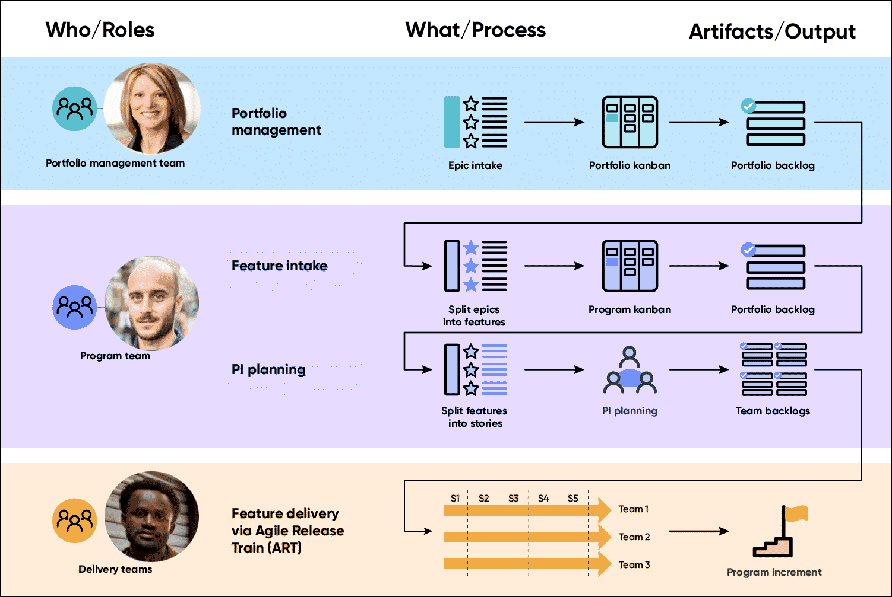
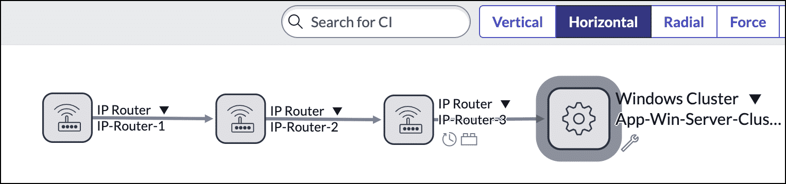
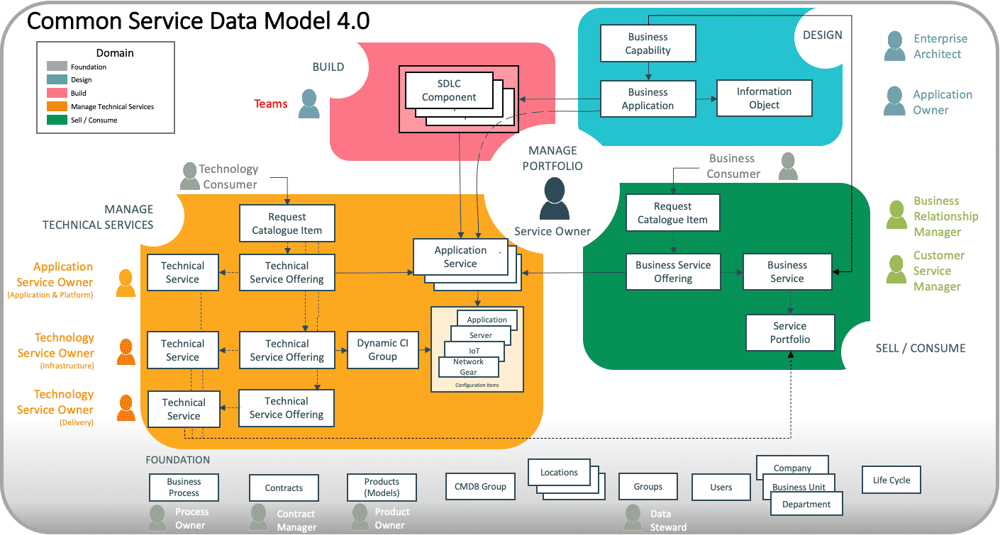
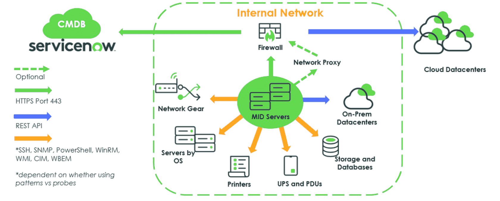
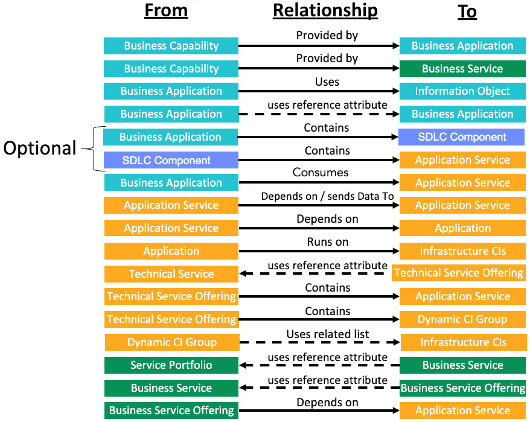

# Week 4 - Notizen

## Agile Foundations

"Agile is not a methodology. It is a mindset."

The Agile Manifesto was created in 2001 by software development experts. It outlines four values aimed at promoting adaptability, collaboration, and delivering customer value over the rigid, plan-driven methods that were previously used:

- Individuals and interactions over processes and tools
- Working software over comprehensive documentation
- Responding to change over following a plan
- Customer collaboration over contract negotiation

Agile working is about bringing people, processes, technology, time, and place together to find the most appropriate and effective way of working to carry out a particular task. It is working within guidelines (of the task) but without boundaries (of how you achieve it).

## Agile vs. Waterfall Methodologies

| Dimension | Waterfall | Agile |
|---|---|---|
| **Executive championship** | Project focused sponsorship, Traditional steering, Standard org-level change | Champions from business and technology, Investment committee, Enterprise transformation |
| **Organizational change** | Fixed scope & timeline, Siloed project teams, Influencer engagement | Fixed timeline + flexible scope, Cross-functional agile team(s), Active participation |
| **Skills and roles** | Title-based roles, Siloed career development | Interconvertible roles, Investment in coaching |
| **Execution model** | Deliverable-based work structure, Put people to work, On-time / On budget, Siloed release management | Outcome-focused delivery, Bring work to teams, Velocity and burndown chart, Automation & continuous deployment |

> **Quiz**
> **Q:** Which statement best describes the purpose of Agile frameworks?
> **Options:**
> - They eliminate the need for documentation in software development projects.
> - They provide a fixed and prescriptive set of rules for project management.
> - They are only applicable to software development teams.
> - They help organizations adopt flexible and collaborative ways of working.
> **Correct:** They help organizations adopt flexible and collaborative ways of working.
> **Erklärung:** Agile frameworks are designed to facilitate flexibility, collaboration, and iterative development across organizations.

Key Agile frameworks covered: Scrum, Scrum of Scrums, SAFe, and Hybrid.

## Agile Frameworks

**Agile frameworks: Scrum focused frameworks**

**Scrum**
- Iterative approach to developing working software quickly and more simply
- Emphasizes teamwork, accountability, and iterative progress toward a well-defined goal
- Completeness of work responsibility is on the Scrum team

**Scrum of Scrums**
- Scaled agile technique that connects multiple teams who need to work together to deliver complex solutions
- Allows teams to communicate to ensure that the output of each team integrates well with the others

**SAFe (Scaled Agile Framework)**
- Set of organization and workflow patterns intended to guide enterprises in scaling lean and agile practices
- Promotes alignment, collaboration, and delivery across large numbers of agile teams
- Core values: alignment, built-in quality, transparency, and program execution

**Hybrid**
- Combines agile and waterfall methodologies
- Typically: execution phase uses agile; initiating, planning, design, verification, and closure use waterfall

## What is Scrum?

Scrum is a framework for addressing complex, adaptive problems while delivering high-value products. Often confused with agile, but Scrum is a framework for getting work done; agile is a mindset. Principles apply beyond software development.

## Scrum Values

**Courage**
- Challenge assumptions, speak up about blockers, raise risks early
- Change direction when needed, make tough architectural or product decisions

**Focus**
- Everyone focuses on the sprint work and the Scrum team's goals
- Work on fewer things at a time to deliver better results
- Architects help teams focus by removing complexity and unnecessary work

**Commitment**
- Everyone is dedicated to the team's objectives and agrees to deliver value each sprint
- Applies not just to tasks, but to quality, continuous learning, and improvement

**Respect**
- Every role brings unique value: developers, product owners, architects, and testers
- Fosters healthy collaboration, especially when technical and business perspectives differ

**Openness**
- Transparency about progress, design decisions, risks, and impediments
- Architects must be open to feedback and new ideas, even if they challenge previous designs

## Sprint

Scrum operates through iterations called sprints. A sprint is a time-boxed amount of work which results in a potentially releasable product. Any sprint lasts up to a month, during which a team delivers a specific list of agreed-upon items fitting into the confirmed definition of "done."

## Scrum Roles and Ceremonies

Three roles describe the key responsibilities on the Scrum team. These are roles, not job titles.

**Product Owner**
- Responsible for the vision of a product and what features it should contain
- Defines and prioritizes features, known as the product backlog

**Scrum Master**
- Helps the Scrum team perform at their highest level
- Holds the team accountable to their working agreements, Scrum values, and the Scrum framework

**Development Team**
- Structured and empowered to organize and manage their own work
- Self-organize to decide how to best accomplish the work

## Scrum Ceremonies

Key events that help teams plan, execute, and reflect within a sprint.

**Sprint Planning**
- Entire Scrum team collaborates on high-priority work and defines the sprint goal (usually 4 hours / 2-week sprint)
- Scrum master facilitates; product owner describes the objective and answers questions on acceptance criteria
- Development team has the final say on how much work it can accomplish

**Daily Scrum**
- 15 minutes (or less) every day to inspect progress toward the sprint goal
- Not a status meeting; an opportunity to inspect and adapt the product and process daily
- Team describes work, asks for help if needed, checks if still on track

**Sprint Review**
- Occurs at the end of the sprint; focuses on the potentially shippable product increment
- Stakeholders are invited to discuss what was completed; product backlog is adapted based on feedback
- Product owner has the option to release any completed functionality
- Primary purpose: inspect and adapt capability through discussion (demo is optional)

**Sprint Retrospective**
- Focuses on the delivery process, not the product
- Team discusses what went right and areas for improvement
- Makes tangible plans for improving process, tools, and relationships

## Scrum of Scrums

Scaled agile technique that connects multiple teams who need to work together to deliver complex solutions. Applies nearly the same practices, events, and roles as a regular Scrum team.

- Teams are made up of 4-6 people (too small or large = delivery struggles)
- Consists of delegates with embedded links to the originating delivery teams
- Interlinking team structures reduce communication paths compared to typical org hierarchies
- Used as a first step to scale agile and organize delivery of larger, complex products
- Additional roles may be required (e.g., architects, QA leaders) to deliver an integrated, potentially shippable product at the end of every sprint

> **Quiz**
> **Q:** Which of the following is an event within the Scrum lifecycle?
> **Options:**
> - Sprint introspect
> - Sprint retrospective
> - Sprint epic
> - Sprint stories
> **Correct:** Sprint retrospective
> **Erklärung:** A sprint retrospective is a Scrum ceremony where the team discusses what went right and areas for improvement in the sprint.

> **Quiz**
> **Q:** Your customer is using a hybrid approach, combining agile and waterfall methodologies. In what stage of the project is the agile approach typically applied?
> **Options:**
> - Initiate
> - Plan
> - Design
> - Execute
> - Verification
> - Close
> **Correct:** Execute
> **Erklärung:** The execution phase is the one where agile is applied, while initiating, planning, design, verification, and closure use waterfall.

## SAFe (Scaled Agile Framework) — Deep Dive

SAFe is a framework for scaling agile across the enterprise. It helps businesses continuously and more efficiently deliver value on a regular and predictable schedule. It provides a knowledge base of proven, integrated principles and practices to support enterprise agility.

> **SAFe Configurations (4 total)**
>
> **Essential SAFe**
> - The most basic configuration
> - Describes the most critical elements needed; provides most of the framework's benefits
> - Includes the team and program levels, called Agile Release Trains (ARTs)
>
> **Large Solution SAFe**
> - Incorporates Essential SAFe elements
> - Adds a solution program level for coordination and synchronization across multiple programs
> - Does not include portfolio considerations
>
> **Portfolio SAFe**
> - Consists of Large Solution SAFe and Essential SAFe elements
> - The portfolio level includes concerns for strategic direction, investment funding, and lean governance
>
> **Full SAFe**
> - Combines the other three levels; the most comprehensive configuration
> - Supports building large, integrated solutions that typically require hundreds of people to develop and maintain
>
> **SAFe Concepts**
>
> SAFe applies lean and agile principles to a large enterprise, enabling development and delivery of software products with fewer defects in the shortest viable lead time.
>
> | Concept | Description |
> |---|---|
> | **Epic** | Container for a significant solution development initiative; captures substantial investments within a portfolio |
> | **Feature** | A service that fulfills a stakeholder need; container of stories; implemented within one program increment; includes benefit hypothesis and acceptance criteria |
> | **Story** | Brief statement encapsulating a product requirement or business case; must be small enough for completion in one sprint |
> | **Agile Release Train (ART)** | A set of teams working towards a single solution |
> | **Program Increment (PI)** | A time frame (8-12 weeks) in which teams in an ART work in collaboration to deliver work |
>
> **SAFe Process Flow (Who / What / Artifacts)**
>
> **Portfolio Management Team**
> - Process: Epic intake → Portfolio kanban → Portfolio backlog
>
> **Program Team**
> - Feature intake: Split epics into features → Program kanban → Portfolio backlog
> - PI planning: Split features into stories → PI planning → Team backlogs
>
> **Delivery Teams**
> - Feature delivery via Agile Release Train (ART)
> - Sprints S1-S5 run in parallel across teams → Program increment

> **SAFe Roles and Ceremonies**
>
> All SAFe agile teams include two key roles: Scrum master and product owner. They power the Agile Release Train (ART) and ultimately the entire enterprise.
>
> **Team level**
> - **Product owner** — defines stories and prioritizes the team backlog to streamline execution of program priorities while maintaining conceptual and technical integrity of features/components
> - **Scrum master** — servant leader and coach; educates the team in Scrum, XP, Kanban, and SAFe; ensures the agreed-upon agile process is followed
>
> **Large solution level**
> - **Release train engineer** — servant leader and coach for the ART; facilitates ART events and processes; assists teams in delivering value
> - **System architect** — defines and communicates a shared technical and architectural vision for an ART; ensures the system is fit for its intended purpose
>
> **Program level**
> - **Solution manager** — prioritizes capabilities and ensures they are well-defined and understood
> - **Solution architect/engineer** — designs and shares the architectural vision across multiple ARTs; ensures solutions are fit for purpose
>
> **Portfolio level**
> - **Epic owners** — define an epic, articulate its benefits, and facilitate its implementation
> - **Enterprise architect** — Drives architectural initiatives for the portfolio.

## SAFe Ceremonies

**Team level**
- **Sprint planning** — Team determines how much of the backlog to commit to for the upcoming iteration
- **Sprint review** — Cadence-based; inspect increment at end of iteration, adjust backlog for next
- **Sprint retrospective** — Discuss iteration results, review practices, identify improvements

**Program level**
- **PI planning** — Cadence-based ART heartbeat; aligns all teams to a shared mission and vision
- **Inspect and adapt** — End-of-PI event; demonstrate and evaluate current solution state across the ART
- **System demo** — Integrated view of new features from most recent iteration across all ART teams

**Large solution level**
- **Solution demo** — Integrates development from all ARTs and suppliers; visible to customers/stakeholders for feedback
- **Pre- and post-PI planning** — Prepare for and follow up after PI planning for ARTs and suppliers in a solution train

**Portfolio level**
- **Strategic portfolio review** — Quarterly event; continuous alignment of strategy, implementation, and budget toward portfolio vision

> **Quiz**
> **Q:** What is the role of an Epic Owner in SAFe?
> **Options:**
> - Responsible for designing and sharing the architectural vision across multiple agile release trains (ARTs)
> - Responsible for prioritizing capabilities and ensuring they are well-defined
> - Responsible for defining an epic, articulating its benefits, and facilitating its implementation
> - Responsible for driving architectural initiatives for the portfolio
> **Correct:** Responsible for defining an epic, articulating its benefits, and facilitating its implementation
> **Erklärung:** Epic Owners are responsible for defining an epic, articulating its benefits, and facilitating its implementation at the large solution level

## Framework Implementation

**Working with a platform team** — When multiple teams work on org-wide features (Scrum of Scrums, SAFe), a dedicated platform team runs in parallel with functional teams to maintain shared components and ensure scalability.

- Centrally manages platform health, shared/global-scope capabilities, and operations (incident, problem, change, release, deployment management)
- Provides services to functional teams within the same or across value streams
- Leads platform operation automation (e.g., CI/CD pipeline)
- Concept based on Site Reliability Engineering (SRE), introduced by Google: [SRE Book — Introduction](https://sre.google/sre-book/introduction/)

## Which Framework to Implement

Overview to help identify the most relevant agile framework for a given ServiceNow platform situation.

| | **Scrum** | **Scrum of Scrums** | **SAFe** |
|---|---|---|---|
| **Team size/scale** | Small, collocated, cross-functional teams; 1-2 teams on same scope | Small teams, less than 50 people on separate scopes | Dedicated teams at much larger scale (50-125 people) |
| **Dependencies** | No dependency between teams | Agile teams have dependencies for product release | Multiple value streams managed in coordination |
| **Releases** | Product releases involve only one agile team | Several instances to manage | Already familiar with agile principles, artifacts, and ceremonies |

## Hybrid Methodology

**Now Create** is ServiceNow's prescriptive proven methodology to achieve faster time to value with less risk and better outcomes.

The phases follow a hybrid agile model: Waterfall for well-understood, predictive parts; Agile for iterative, uncertain parts (story development).

- Waterfall-based phases: Initiate, Plan, Execute, Deliver, Close
- Agile techniques (sprints, stories, scrum) are used within parts of the Execute phase

*Now Create Success Pack*

**A hybrid approach** combines structure, formality, and documentation (Waterfall) with flexibility, adaptability, and speed (Agile) — creating a custom approach optimal for every situation.

Reference: [Traditional or Agile Alone Won't Cut it](Traditional%20or%20Agile%20Alone%20Won't%20Cut%20it.PDF)

> **Quiz**
> **Q:** What framework should you consider when multiple value streams need to be managed in coordination?
> **Options:**
> - Scrum
> - Hybrid
> - Scrum of Scrums programs
> - SAFe
> **Correct:** SAFe
> **Erklärung:** SAFe should be considered when multiple value streams need to be managed in coordination.

## Key Takeaways — Agile Frameworks

1. **Explore various agile frameworks** — Understand the differences and applications of Scrum, Scrum of Scrums, SAFe, and hybrid methodologies. Tailor agile practices to align with specific project and organizational requirements.
2. **Recognize the importance of roles** — Key roles like Scrum Master and Product Owner are vital for team success, project alignment, and effective project governance.
3. **Establish a platform team** — Centralize management of shared components and operations to enhance scalability and efficiency.

Resources:
- [Agile Management Resources.pdf](Agile%20Management%20Resources.pdf)
- [SAFe Concept Resources.pdf](SAFe%20Concept%20Resources.pdf)
- [Agile Frameworks Resource Guide.pdf](Agile%20Frameworks%20Resource%20Guide.pdf)
- [Top 5 main Agile methodologies: advantages and disadvantages](https://www.xpand-it.com/blog/top-5-agile-methodologies/)

## Introduction to CMDB and CSDM

### What is the CMDB?

The Configuration Management Database (CMDB) is a single system of record for digital products and service data for use across ServiceNow applications, including the logical configurations your network infrastructure needs to support a service.

Organizations use the CMDB to build logical representations of assets, services, and the relationships between them. These relationships make up the infrastructure of an organization. Details about these components are stored in the CMDB which is used to monitor the infrastructure, helping ensure integrity, stability, and continuous service operation.

The ServiceNow CMDB consists of entities called configuration items (CI). Configuration item attributes must be maintained, and changes tracked, to ensure their dependencies and relationships with other CIs are accurate. A configuration item may be:

- A physical entity, such as a computer or router
- A logical entity, such as an instance of a database
- A conceptual entity, such as a requisition service

A configuration item and an asset may refer to the same physical or virtual object but they are tracked differently because they serve different purposes. A CI supports ITSM and records technical data, while an asset supports financial and lifecycle management and records financial data. Assets are often CIs, but not all CIs are assets.

The effectiveness of the CMDB as a decision-support tool can be significantly enhanced through the use of relationship data. The CMDB helps track both the configuration items and their relationships to other CIs. By maintaining accurate and comprehensive relationship data, the CMDB not only enhances its role as a decision-support tool but also drives better business outcomes through improved service quality, accountability, and operational efficiency.

Configuration items differ from environment to environment because each customer has unique needs. Details about the exact physical attributes of a computer may be needed by one customer but may represent meaningless data to another. The Now Platform provides a mechanism to easily define new classes of configuration items, attributes, and new relationships that may exist between CIs. New classes can be defined that extend other classes.

### What is CSDM?

CSDM is a standard and consistent set of terms and definitions to adopt across all ServiceNow products on the Now Platform. It is a data framework and common model used by all ServiceNow products and integrations.

The CSDM is the data framework that administrators should follow when they set up ServiceNow products and applications. CSDM enhances the management of digital products and services by ensuring that data resides in the appropriate CMDB tables, leading to improved quality, insights, automation, and lower costs. The CSDM is a blueprint that should be followed when you implement ServiceNow.

The CMDB is the heart of many activities and processes within the ServiceNow platform; the CSDM tells us how the data is related or referenced across the platform.

Like any good architectural blueprint, CSDM gives data and processes the underlying coherence to govern current operations and to guide future innovation. The CSDM conceptual model has evolved over time, with v4.0 the officially published version and "current" version.

> **CSDM 4.0 Domains:**
>
> **Build**
> Represents the tables used to build digital products like DevOps. Includes a new CMDB class: Software Development Lifecycle Component (SDLC). Records in these tables are direct targets of ITSM Incident, Problem, and Change Management processes. They represent the logical development details of enterprise applications to be deployed and used by the business.
>
> **Design**
> Represents the tables used to rationalize and manage business applications. These tables are not operational — they cannot be selected for Incident Management or Change Management. Also used by ServiceNow Application Portfolio Management (APM), but APM is not required.
>
> **Manage Technical Services**
> Represents the portfolio of technical services in use. These services are operational — they can be selected for Incident Management and Change Management. Used by ServiceNow ITOM (Service Mapping and Discovery) to manage CIs and relationships, but ITOM is not required.
>
> **Sell/Consume**
> Represents the portfolio of business services that may sell or consume elements of the Manage Technical Services domain, as well as the products that enable managing workflows and reporting service-related data. Used by Service Portfolio Management (SPM) and Customer Service Management (CSM), but these are not required.
>
> **Foundation**
> Contains critical referential data and base data referenced from or to objects in the other CSDM domains. Foundation data is not used in CMDB relationships, but is required before using ServiceNow products or adding data to the CMDB.

The latest CSDM iteration (v5.0) is designed to support organizations through the age of Artificial Intelligence (AI).

### CSDM v5.0 Domains

**Design & Plan**
Enhanced in v5.0 to handle business applications, platform hosts, and product models.

**Build & Integrate**
In v5.0 includes software bill of materials (SBOM) support in line with Cyclone DX specifications.

**Deliver**
In v5.0 introduces the "Service Instance" base class, providing greater flexibility for different industry contexts.

**Consume**
Focuses on offerings, products, and services available to customers.

**Ideate**
A new domain in CSDM v5.0 capturing planning elements and business models.

### CSDM: A Staged Approach

ServiceNow does not recommend implementing all elements of the CSDM data model at once. The recommended staged approach breaks down into five stages:

| Stage | Focus |
|---|---|
| **Foundation** | OOB referential tables: company, business unit, department, locations, groups, users, CMDB group, product models, and contracts |
| **Crawl** | Four base-system CMDB tables: business application, application service, application, and server/host |
| **Walk** | Three additional OOB tables: Technology Management Service, Technology Management Service Offering (service classification: Technical Service), and Dynamic CI Group |
| **Run** | Three additional OOB tables: Business Service Portfolio (not a CMDB table), Business Service (service classification: Business Service), and Business Service Offering (service classification: Business Service) |
| **Fly** | Two additional OOB tables: Business Capability and Information Object. Request catalog capabilities with Service Offerings are also valuable |

> **Quiz**
> **Q:** Which of the following statements about the Common Service Data Model (CSDM) are correct? (Select all that apply)
> **Options:**
> - CSDM is primarily used to monitor network infrastructure configurations.
> - CSDM is only applicable to organizations using ServiceNow IT Operations Management (ITOM).
> - CSDM provides a standard set of terms and definitions for use across all ServiceNow products.
> - CSDM ensures that data resides in the appropriate CMDB tables, improving quality and automation.
> - The CSDM conceptual model includes domains such as Build, Design, and Consume.
> **Correct:** CSDM provides a standard set of terms and definitions for use across all ServiceNow products. / CSDM ensures that data resides in the appropriate CMDB tables, improving quality and automation. / The CSDM conceptual model includes domains such as Build, Design, and Consume.
> **Erklärung:** CSDM provides a standardized framework for managing data across ServiceNow products, ensuring data quality and supporting various domains like Build, Design, and Consume.

## Three Pillars of CMDB

ServiceNow has created three "pillars to success" when it comes to operationalizing the CMDB: ingestion, governance, and insight.

**Ingestion**
The ingestion pillar is responsible for the continuous intake of data, which includes processes for merging, updating, and deleting data as necessary. This ensures that data from various sources is consolidated into a single, reliable model.

**Governance**
The governance pillar focuses on structuring CMDB management by establishing dedicated teams and clearly defined roles. It involves automating lifecycle processes, and aligning the CMDB with the CSDM to standardize service modeling.

**Insight**
The insight pillar focuses on establishing a framework for reporting and metrics. It emphasizes using analytics to transform datasets into actionable insights, supporting operational processes such as incident and change management.

## Pillar One: CMDB Ingestion

### CMDB Data Ingestion Tools

The ingestion pillar is all about populating the CMDB and the ServiceNow tools that are used to automate the process of continuously bringing in CMDB data and ensuring the data is placed in the right tables.

**ServiceNow Discovery**

Discovery is an automated solution that scans and detects all components within an organization's IT infrastructure on a scheduled basis. It plays an important role in ensuring accurate and up-to-date CMDB information is populated and continuously updated.

**1. Scan the network**
Discovery can be set to run automatically at specific intervals or triggered by certain events. It scans designated IP address ranges to locate devices. Discovery uses port probes to detect open ports on devices. If no open ports are found for the configured probes, the discovery process halts.

**2. Identify devices and applications**
Discovery attempts to log in to devices using pre-configured credentials. Once logged in, it runs scripts to identify and extract data about each device, such as hostname, manufacturer, model, serial number, CPU, RAM, network adapters, disks, installed programs, and more.

**3. Update the CMDB**
Discovery adds devices and applications as configuration items in the CMDB. It identifies and creates relationships between systems, such as an application on one server using a database on another. Discovery updates existing CIs or creates new ones in the CMDB based on the gathered information.

**Types of Discovery**

- **Horizontal Discovery:** Scans the network to find computers and devices, populating the CMDB with the CIs it discovers.
- **Top-down Discovery:** Used by Service Mapping; identifies and maps services by understanding the relationships and dependencies between applications and infrastructure components.

**Service Mapping**

Service Mapping is an application that works with Discovery to find all application services within an organization and build a comprehensive map of all devices, applications, and configuration profiles used in these application services.

**Agent Client Collector (ACC)**

ACC is an agent-based solution designed to perform discovery and real-time monitoring of infrastructure components, including servers, cloud resources, and applications across an organization. ACC complements Discovery by finding IT resources without needing credentials or firewall exceptions. It gathers identification, status, health, and security data from devices, and collects performance metrics, logs, and configuration data from various endpoints.

**IntegrationHub ETL**

IntegrationHub ETL (extract, transform, load) is a ServiceNow Store app that can be used to create and manage ETL transform maps, which integrate third-party data into the CMDB or into non-CMDB tables.

IntegrationHub ETL uses two key components for processing:

- **Robust Transform Engine (RTE):** Transforms raw source data stored in staging tables by using ETL transform maps to convert the raw data into a format suitable for the CMDB.
- **Identification and Reconciliation Engine (IRE):** Identifies whether a CI already exists in the CMDB and applies reconciliation rules to prevent duplicate CIs, maintaining data integrity.

**Service Graph Connectors**

Service Graph Connectors are pre-built integrations that facilitate the integration of third-party data sources with the CMDB. They are designed to ingest data from various domains such as security, servers, software, IoT (Internet of Things), and cloud services. These connectors use the Identification and Reconciliation Engine (IRE) and IntegrationHub ETL to ensure that data is accurately populated in the CMDB.

**Import Sets and Transform Maps**

- **Import sets:** Temporary staging tables that receive data from external sources. They allow data to be ingested without directly affecting the CMDB, providing a buffer to handle data in different formats or structures.
- **Transform maps:** Once data is in the import sets, transform maps map and transform it into the appropriate CMDB tables and fields. They ensure data is correctly formatted and placed, reconciling differences from various sources to maintain data integrity and consistency.

> **Quiz**
> **Q:** Why is it important to use the Identification and Reconciliation Engine (IRE) with Service Graph Connectors?
> **Options:**
> - To create custom data formats
> - To delete outdated data entries
> - To convert raw data from staging tables into a format suitable for the CMDB
> - To maintain the accuracy and integrity of populated data
> **Correct:** To maintain the accuracy and integrity of populated data
> **Erklärung:** The IRE helps maintain data accuracy and integrity during the integration process.

## Pillar Two: CMDB Governance

CMDB governance is about maintaining the health of the CMDB once data has been ingested using automated tools and processes.

### CMDB Health Dashboard

The CMDB Health dashboard provides administrators with a central location to view detailed health reports and remediate detected issues. These issues focus on the completeness, correctness, and compliance of CMDB data.

**Views**

The CMDB Health Dashboard incorporates three views:

- **Class view:** Default view, showing health reports for CIs and classes in the CMDB hierarchy.
- **Service view:** Health reports for services with details for CIs per service.
- **Health group view:** Health reports for CMDB groups of type Health with details for CIs per group.

**KPI tiles**

The Completeness, Correctness, and Compliance KPI tiles show aggregated health for CIs of the specified class, health group, or service:

- Green: CIs that are compliant on all KPI metrics
- Red: CIs that fail one or more metric

Percentage is calculated as: number of healthy CIs / number of CIs evaluated.

**Calculation details**

Each KPI breaks down into sub-metrics:

- Completeness: Recommended, Required
- Correctness: Staleness, Orphan, Duplicate
- Compliance: Audit

**Metric details**

The metric details displayed depend on the selected KPI tile. For example, the Correctness KPI tile shows a breakdown by: duplicate CIs, orphan CIs, and stale CIs.

> **CMDB Health Dashboard scores and metrics are updated using scheduled jobs (All > Configuration > Health Preference > Scheduled Jobs).**

### IRE and Duplicate CIs

Duplicate CIs in the CMDB can have multiple causes: integrating data from multiple sources (import sets, REST, integrations), and manually creating CIs. The Identification and Reconciliation Engine (IRE) consolidates data from various sources to prevent duplication by uniquely identifying configuration items.

**CI Identification rules**

Identification rules are used to uniquely identify CIs in the CMDB. Each CMDB class can be associated with a single identification rule.

**CI Reconciliation rules**

Reconciliation rules fall into two categories:

- **Static rules:** Used in conjunction with data refresh rules to determine reconciliation steps for a CI. They determine if, when, and by which discovery source a CI can be updated.
- **Dynamic rules:** Use CMDB 360 data to choose a value (e.g., the largest reported value) for updating a CI. Requires enabling CMDB 360/Multisource CMDB.

**Data refresh rules**

Data refresh rules determine if a CI is stale (not updated for a specified amount of time) for a specific discovery source. Such CIs can then be updated by a lower-priority authorized discovery source.

**Data source rules**

Data source rules are created for discovery sources that are not trusted to create CIs but are trusted to update existing ones. Used in conjunction with static reconciliation rules; have no impact when dynamic rules are active.

### De-duplication

**Duplicate CI Remediator**

If the instance encounters duplicate CIs during identification and reconciliation, it groups each set of duplicates into a de-duplication task. The Duplicate CI Remediator is then used to step through the duplicate CI reconciliation process.

The remediation process allows for the merging of relationships and related items and the deletion of duplicate records.

**Reclassification**

During the CI identification process, a matched CI might need to be switched to another CI class. CIs can be automatically reclassified from one class to another, or can have a reclassification task generated with the option to manually review and reclassify the CI.

### Lifecycle Management

Tools like Life Cycle Mapping and Data Manager can support this process.

**Life Cycle Mapping**

Use the Life Cycle Mapping module to specify how existing legacy status values should be converted to CSDM life-cycle value pairs (life cycle stage and life cycle stage status). These fields are recommended for organizations aiming to align more closely with CSDM best practices.

**CMDB Data Manager**

CMDB Data Manager is a framework for bulk management of CI life cycle operations. Large CMDBs can over time accumulate large amounts of stale CIs that impact overall performance. The CMDB Data Manager creates policies that automate and govern CI life cycle operations to help maintain the CMDB in a healthy and efficient operational state. A policy consists of:

- A policy type (e.g., attest, certify, retire, delete)
- Filters used to apply conditions to select specific records from a table
- Assignment type and target (group/user)
- The timeframe for task completion once the policy has run and identified records that need to be updated

> **A scheduled job processes published Data Manager policies and policy tasks are assigned as set in the policy. Individuals or group members the task is assigned to locate their tasks in the CMDB Workspace.**

> **Quiz**
> **Q:** Which tools can assist with identifying and preventing duplicate CI data? (Select two)
> **Options:**
> - CMDB Health Dashboard > Correctness KPI
> - Life cycle mapping
> - Identification and Reconciliation Engine
> - CMDB Health Dashboard > Completeness KPI
> **Correct:** CMDB Health Dashboard > Correctness KPI, Identification and Reconciliation Engine
> **Erklärung:** The CMDB Health Dashboard > Correctness KPI identifies duplicate CIs, while the Identification and Reconciliation Engine prevents duplicates.

## Pillar Three: CMDB Insight

ServiceNow provides several robust solutions to aid and automate the collection of data into the CMDB, supporting the insight pillar to realize value from a healthy CMDB.

### CMDB Query Builder

The CMDB Query Builder offers a drag-and-drop interface for constructing complex queries across both CMDB classes and non-CMDB tables, without coding. It enables users to query configuration items and their relationships, and provides options to save, schedule, and export queries in various formats. It also supports report generation for more informed decision-making.

### Unified Map

The ServiceNow Unified Map is a feature within the CMDB Workspace that merges the functionalities of the legacy Dependency Map and Service Map into a single interface. It provides a visual representation of the relationships between CIs within an IT infrastructure.

Useful for understanding dependencies of an outage or interruption, and assessing the potential impact of changes.

### CMDB and CSDM Data Foundations Dashboards

The CMDB and CSDM Foundations Dashboards ensure the CMDB is well-structured and aligned with the CSDM framework. They provide a comprehensive view and insights to help maintain and improve configuration management processes, available via the Management tab of the CMDB Workspace.

> **The CSDM and CMDB Data Foundations Dashboards (sn_getwell) plugin must be installed to use this feature.**

- **CSDM dashboard:** indicators grouped by maturity level (Foundation, Crawl, Walk, Run, Fly)
- **CMDB dashboard:** indicators grouped by Best Practices, Customizations, Data Management Practices, and ITSM Processes

> **Refer to [CMDB and CSDM Data Foundations Dashboards Indicators](https://www.servicenow.com/docs/bundle/xanadu-now-intelligence/page/use/dashboards/reference/cmdb-csdm-indicators.html) for a comprehensive list and explanation of the indicators used on the dashboards.**

> **Quiz**
> **Q:** Which tool would be most beneficial for a Service Desk Agent seeking to understand the downstream impacts of an outage on a CI?
> **Options:**
> - CMDB Data Foundations Dashboard
> - CMDB Query Builder
> - CMDB Workspace
> - Unified Map
> - CMDB Health Dashboard
> **Correct:** Unified Map
> **Erklärung:** The Unified Map provides a holistic view of IT infrastructure and relationships that helps in understanding the impact of incidents.

## Align the CMDB with CSDM

### Data Modeling for Alignment

As a CTA, you take a lead role in aligning to the Common Service Data Model. This requires bringing people together to gather data, whether the organization is just starting out with ServiceNow or has been on the platform for some time. These steps ensure a thorough approach to data modeling for CMDB-CSDM alignment:

**Prepare**

Determine the implementation approach: service-focused or application (IT)-focused. For prior implementations, ensure alignment with previous efforts. Assign appropriate resources:

- Enterprise architect
- CMDB manager
- Process owners
- ServiceNow product owner
- ServiceNow developer or administrator

For legacy deployments: map and migrate existing life cycle values to align with standard CSDM values, and enable the necessary plugins.

**Gather data**

Depends on the chosen approach:

- **Application-focused:** Collect a comprehensive list of business applications and their corresponding production installs.
- **Service-focused:** Gather a list of services along with the applications used to deliver them, particularly those necessary for day-one service management readiness.

For legacy implementations: run a CMDB Health Scan to assess data quality, use scripts to evaluate the impact of data remediation, and implement necessary corrections.

**Model data**

- **Application-focused:** Use the [Data Modeling Workbook](https://learning.servicenow.com/nowcreate/en/pages/assets?id=nc_asset&nc_ai_search=true&asset_id=abda54d987cbd9d4046fff38dabb351d&sys_id=36db3af2db954dd00c912b691396194c&table=x_snc_accel_asset&searchTerm=data%20modeling%20workbook) along with data diagrams to define and document application data structures and visualize relationships and dependencies.
- **Service-focused:** The customer provides a Service Taxonomy to guide the effort. Services are related to supporting applications. The Data Modeling Workbook is used especially when a large number of services are already defined. The Service Builder tool can be used to create and maintain formal service definitions.

Regardless of approach: develop processes and governance structures to ensure long-term sustainability, accuracy, and alignment of modeled data.

**Enter data**

Use import sets to load CSDM-related data types: Business Applications, Application Services, Business Services, Technical Services, Business Service Offerings, Technical Service Offerings, and key relationship data (Consumes, Contains, Depends on). Manual entry is used for cases requiring individual validation or not suited for bulk loading. Review and test data entry processes to ensure accuracy, consistency, and completeness.

**Maintain/Use data**

Use key tools to monitor and manage data integrity: Dashboards, Data Foundations, CMDB Health, CMDB Workspace, and Data Manager. Create reports and dashboards for operational visibility. Train data users and owners on how to use, select, maintain, update, and manage the life cycle of data elements (creating or retiring as needed).

### CI Relationships in the CSDM

During the Enter data stage, the results of data modeling (CSDM-related data types and their relationships) are imported into the CMDB. Correct relationships between CIs and objects in the CSDM conceptual model are essential. Many ServiceNow features and products (e.g., Enterprise Architecture, formerly Application Portfolio Management) rely on these relationships to function properly.

When setting up infrastructure CIs, the relationships typically created by Service Mapping and Discovery are the standard. If creating relationships manually, ensure they align with how Discovery would normally handle them.

Keep in mind:

- Not every object in the CSDM conceptual model is represented by a CMDB table
- Not all objects have built-in relationships
- You may need to create some essential relationships yourself to ensure proper functionality

> **Refer to [How CSDM concepts map to CMDB tables](https://www.servicenow.com/docs/bundle/xanadu-servicenow-platform/page/product/csdm-implementation/concept/csdm-to-cmdb-mapping.html) in the ServiceNow documentation.**

> **Quiz**
> **Q:** In the Prepare stage of the data modeling process, what is one of the key responsibilities?
> **Options:**
> - Create data certification schedules
> - Use Data Modeling Workbook
> - Determine the implementation approach
> - Activate import sets
> **Correct:** Determine the implementation approach
> **Erklärung:** In the Prepare stage, it must be decided whether the implementation will be service-focused or application-focused.

## Key Takeaways — CMDB and CSDM

1. **Understand the CSDM framework:** It is a blueprint for managing ServiceNow applications effectively and is foundational to getting continued value from an implementation.
2. **Use and promote CMDB tools effectively:** Tools like the CMDB Health Dashboard, CMDB Query Builder, and Data Manager support data quality and help customers maintain CMDB governance and insight.
3. **Apply structured data modeling processes:** Tailor approaches based on whether the focus is on services or applications, and use the Data Modeling Workbook to ensure effective CMDB alignment.

**Additional Resources**

- [CSDM Data Model Examples](https://mynow.servicenow.com/now/best-practices/assets/csdm-data-model-examples) (PPT)
- [Maintain a healthy CMDB](https://mynow.servicenow.com/now/best-practices/assets/maintain-a-healthy-cmdb) (PDF)
- [CMDB Governance](https://mynow.servicenow.com/now/best-practices/assets/cmdb-governance) (PPT)
- [CSDM 5 Whitepaper](https://www.servicenow.com/community/common-service-data-model/csdm-5-finally-get-the-csdm-5-white-paper-here/ta-p/3254967) (Community article)
- [CSDM 101: Everything you need to know](https://www.youtube.com/watch?v=hANONH1c1vQ) (Video)

