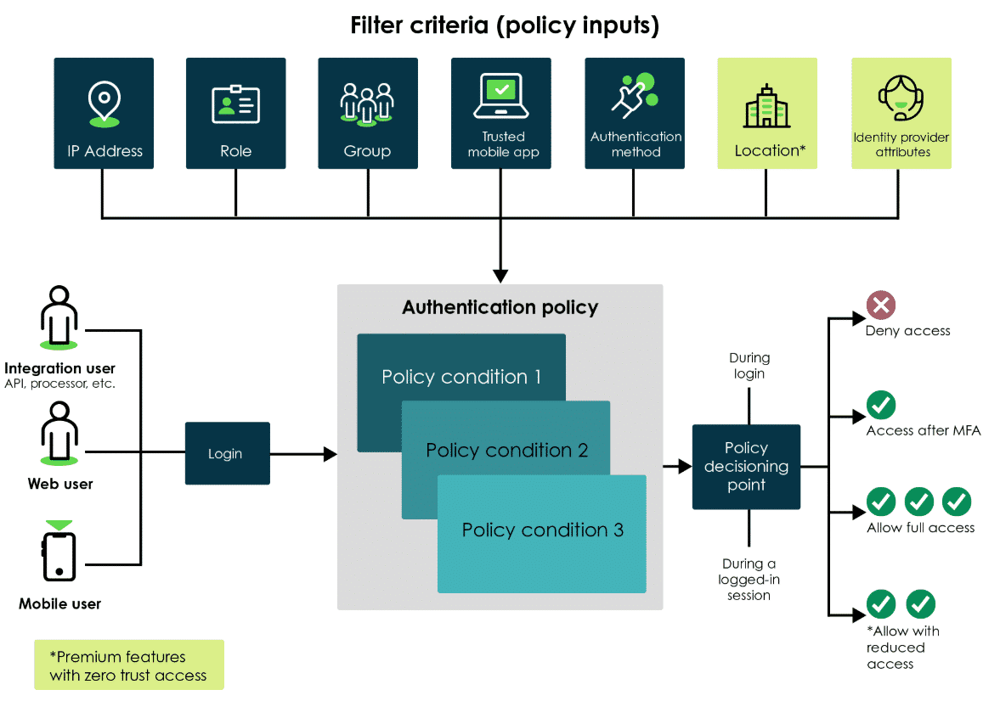
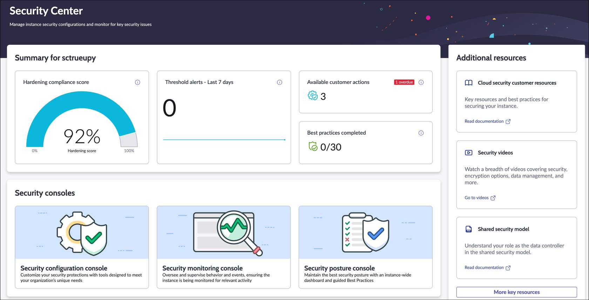
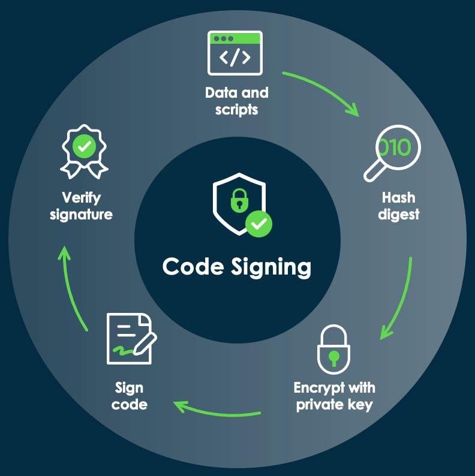
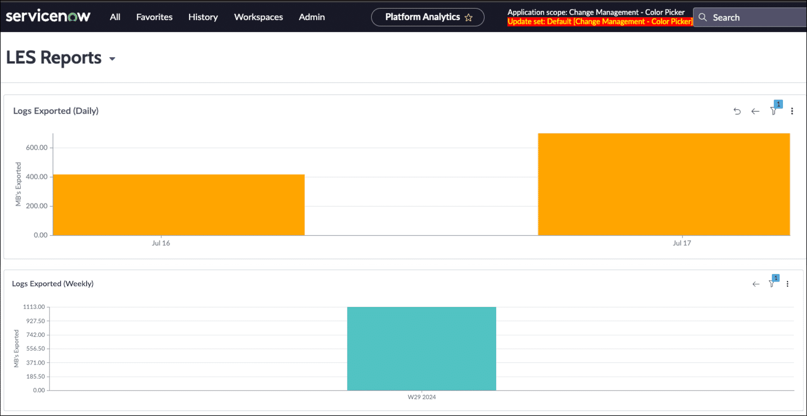

# Week 5 - Notizen

## Security Mindset

As a CTA, develop a security mindset: the predisposition to look for and identify actual or potential security threats and compromises.

Two key questions when architecting a solution:
1. What might go wrong?
2. What can we do to prevent this?

Key traits of a security mindset:
- **Skepticism**: Don't assume everything is safe by default.
- **Curiosity**: Always dig deeper; don't take systems at face value.
- **Proactive thinking**: Prevent problems rather than just reacting to them.
- **Attention to detail**: Small oversights can lead to big security issues.

## Threat Modeling

Threat modeling is a risk-based approach to designing security systems. It provides stakeholders with a systematic method to identify potential threats and develop mitigations.

Answers the questions: "What might go wrong?" and "What can we do to prevent this?"

Outcome: a list of technical threats and security measures.

Further reading: [Agile threat modelling](https://martinfowler.com/articles/agile-threat-modelling.html)

## Shared Security Model

Data processor (ServiceNow) and data controller (customer) are partners in security, each with their own responsibilities. ServiceNow provides capabilities to configure instances to meet the customer's own security policies and requirements.

**Customer (data controller):** responsible for determining how data is collected, stored, used, shared, archived, and destroyed — including maintaining accuracy and confidentiality.

**ServiceNow (data processor):** supports data controllers by providing features to enable access and control of data processing activities and obligations.

| Area of Responsibility | Customer | ServiceNow | Colocation |
|---|:---:|:---:|:---:|
| Security contact details | x | | |
| Secure configuration of instance | x | | |
| Authentication and authorization | x | | |
| Data management (classification and retention) | x | | |
| Data encryption at rest | x | | |
| Data encryption in transit | x | x | |
| Encryption key management | x | x | |
| Security logging and monitoring | x | x | |
| Secure SDLC processes | x | x | |
| Penetration testing | x | x | |
| Vulnerability management | x | x | |
| Privacy compliance | x | x | |
| Compliance: regulatory and legal | x | x | (x) |
| Employee vetting or screening | x | x | (x) |
| Physical security/environment controls | | x | (x) |
| Cloud infrastructure security management | | x | |
| Infrastructure management | | x | |
| Media disposal and destruction | | x | |
| Backup and restore | | x | |

*(x) = partial/supporting responsibility of data center provider*

## Physical Security Architecture

ServiceNow colocation facilities (data centers) are arranged in high-availability regional pairs, spanning five continents: Asia, Australia, Europe, North America, and South America.

All customer production data is stored in both colocation facilities within the pair and kept in sync using real-time database replication. Both facilities are active at all times, each with the ability to support the combined production load of the pair.

All ServiceNow colocation facilities maintain the highest security and reliability standards, including:
- Physical access restricted to authorized ServiceNow personnel
- Round-the-clock security guards and CCTV
- Biometric access controls
- Physical intrusion detection and alarms
- External anti-climb fencing and crash resistant walls
- Physical access audits
- Multiple redundant power distribution paths
- Environmental controls and fire detection and suppression systems

## Logical Security Architecture

Three layers of logical security in platform security architecture:

**Layer 1: Internet Services Layer** (network/proxy layer)
- Includes network routers, switches, load balancers, firewalls, and intrusion detection systems
- All deployed at minimum 2N basis (fully redundant mirrored system with two independent distribution systems)
- Customers and web services connect over HTTPS using TLS 1.2
- Forwards requests from end-users or integrations to the relevant customer instance

**Layer 2: Application Layer**
- Application servers are in a discrete network segment
- Customers access this layer only through Layer 1 (not directly from internet)
- Hosts clustered application nodes for each customer's instance

**Layer 3: Database Layer**
- Database servers installed in a discrete, non-internet routable network segment
- Requests cannot be made directly to the database layer — only issued from the customer's ServiceNow instance
- Each instance has a single database on a server running multiple discrete and segregated database services
- No mixing of customer data between instances and databases (4 instances = 4 entirely separate databases)

> **Quiz**
> **Q:** What is used to identify and lower security risks in an IT landscape?
> **Options:**
> - Threat modeling
> - Physical security
> - Physical architecture
> - Intrusion detection
> **Correct:** Threat modeling
> **Erklärung:** Threat modeling is used to identify and lower security risks in an IT landscape.

> **Quiz**
> **Q:** What is the first layer of platform security, which all requests must go through?
> **Options:**
> - Internet services / network layer
> - Application layer
> - Physical layer
> - Database layer
> **Correct:** Internet services / network layer
> **Erklärung:** Internet services is the first layer and includes network routers, switches, load balancers, firewalls, and intrusion detection systems. This layer forwards requests made from customers' end-users or integrations to the relevant customer instance.

## Network Layer

### IP Address Access Control

ServiceNow encrypts all traffic to and from the instance using HTTPS with TLS 1.2 (data in transit is encrypted). An additional network mitigation option: IP address access control.

> **TLS (Transport Layer Security): security protocol that allows data to be securely transferred over a network.**

IP address access control is activated via the **IP Range Based Authentication plugin** (`com.snc.ipauthenticator`). It allows organizations to specify trusted IP address ranges (allow) and untrusted ranges (deny).

- Applies to outbound, inbound, or bidirectional traffic
- The system only blocks an IP if a matching Deny rule exists and no matching Allow rule exists
- By default, there are no restrictions on access to an instance
- Although restriction is performed in the application layer, it is considered part of the network layer — denied users never reach the application layer

### Certificates

Every customer instance requires certificates to establish secure connections and validate signatures. Customers must generate or purchase a certificate and upload it to the instance.

Use cases:
- **LDAP**: SSL certificate required for the instance to establish an LDAP connection with an LDAP server
- **Outbound web service mutual authentication**: establishes trust by exchanging SSL certificates
- **Web service security**: SSL/TLS certificates for secure encrypted connections between web browsers and servers
- **MID Server**: certificates can be added to communicate over SSL/TLS

### VPN

With more customers using the mobile application on personal devices, originating IPs can be from anywhere. Workarounds: use a VPN to the corporate network or other mobile device management techniques.

A VPN ensures a user's IP is within the company's internal allowed network range. It can also be used to integrate a ServiceNow instance with external data sources over the internet when security or network architecture requirements dictate VPN use between data centers and corporate networks.

> **VPN requests (provisioning, modifications, general questions) are submitted via ServiceNow Support. Typical build time: one week or less.**

> **Quiz**
> **Q:** Why might a company require users to connect through a VPN to access certain ServiceNow environments?
> **Options:**
> - VPNs remove the need for multi-factor authentication
> - VPNs eliminate the need for IP address access control
> - VPNs speed up access to ServiceNow
> - VPNs assign IPs that fall within allowed access ranges
> **Correct:** VPNs assign IPs that fall within allowed access ranges
> **Erklärung:** When connected to a corporate VPN, the user's device is assigned an internal, trusted IP address. IP access controls can be set to only allow these VPN-assigned IPs.

## Application Layer

Four considerations for application layer security:
1. What happens before you get access to the instance?
2. What happens when you log on?
3. What happens while you are on the instance?
4. What is the behavior of the instance itself?

### Pre Logon

Policy framework that enforces authentication controls to the right persona at the right time. Custom access policies can be based on:
- Role of user
- Device used
- Location of user

Policy evaluation outcomes:
- Allow/deny for login
- Enforce multi-factor authentication (MFA)
- Assign least privileged access

### Adaptive Authentication

Validates the identity of a user who accesses an instance, then authorizes the user to features that match their roles. Multiple authentication methods are available.

**Filter Criteria:** Policy inputs that verify and meet the requirements of an authentication request. Example: an IP filter criteria defines a range of IP addresses.

**Authentication Policy:** Evaluates authentication requests based on specified policy conditions and determines whether access is allowed or denied. Example: access is allowed only if all conditions in the Allow Access Policy evaluate to true.

**Policy Decisions** (4 options):
- Allow full access
- Access after MFA
- Allow with reduced access
- Deny access

> **At any point in time, either Allow Access Policy or Deny Access Policy can be executed, but not both.**

### Authentication Tips

- Whenever possible, use the corporate SSO solution so that password strength and reuse policies follow corporate standards
- Enable MFA for local accounts (password policies are not enforced for local accounts)
- The weakest link into an instance is an easy-to-guess local username and password

> **Since Yokohama: MFA enforcement for non-SSO logins. [Docs](https://www.servicenow.com/docs/bundle/yokohama-platform-security/page/integrate/authentication/concept/mfa-enforcement.html)**

### Authorization

Roles combined with ACLs are the most common way to ensure users can only do what they are supposed to. A persona-based structure enables role-based access control (RBAC).

**`security_admin` role:**
- Not inherited — can only be granted by users who already have the role
- Users must "elevate" to this role to use it (additional security step)

### Application Access Settings

Best practice: create any new application in its own scope. Gives control over:

- **Application design and runtime settings**: determine whether an application can access cross-scope resources
- **Table design and runtime settings**: determine whether a table is accessible to other applications during design-time or run-time operations
- **Restricted caller access privilege settings**: define cross-scope access to an application, application resource (e.g. ACL, business rule, UI action, script include), or event — allows or denies requests for access. [Docs](https://docs.servicenow.com/csh?version=latest&topicname=restricted-caller-access-privilege)

### Securing REST APIs

- REST APIs can be secured with ACLs (including the default Table API)
- The REST Table API is open for every user passing the table ACL checks
- Insert and update via REST Table API ignore client script validations, but business rule validations still apply

### Zero Trust Access (ZTA)

ServiceNow ZTA enforces least-privilege access control. Operates on the principle of "never trust, always verify": access is granted based on user identity, device security posture, and context of the request — not simply network location. ZTA can remove or limit a user's role based on defined conditions.

### Instance Settings: Security Center (SSC)

Free application consisting of tools to help organizations maintain the security of their ServiceNow deployments. Improves security posture and strengthens compliance levels.

Three security consoles:

**Security Configuration**: overview of the instance's security posture — hardening compliance score, graphical trends, top non-compliant hardening settings, security scan results

**Security Monitoring**: supervise security notifications and metrics to stay informed about potential security risks

**Security Posture**: improve ability to identify, respond to, and recover from security threats — comprehensive visibility and step-by-step instructions

> **Quiz**
> **Q:** What are the components of the application layer security architecture? (Select four)
> **Options:**
> - Pre logon
> - Authentication
> - Platform Encryption
> - Approval
> - IP address access control
> **Correct:** Pre logon, Authentication, Platform Encryption, IP address access control
> **Erklärung:** Pre logon, authentication, authorization, Platform Encryption, instance hardening, and IP address access control are all part of the application layer security architecture.

## Database Layer

### Database Encryption

Converts data stored in a database into an unreadable format using a key. Data is unusable to anyone without the decryption key. Some customers have policies requiring certain data classifications to be encrypted at rest (i.e., when stored, not being transmitted or accessed).

### Platform Encryption

Subscription bundle that balances data protection and sharing in the cloud — ensures ServiceNow data is encrypted at rest with only authorized users able to access it.

**Field Encryption:** App and database level encryption for data in-use and at-rest.
- Sensitive data within supported field types is permanently encrypted in the database and UI, only temporarily decrypted in the UI via ephemeral object decryption
- Uses **Module Access Policies (MAPs)** to ensure only authorized users, scripts, and system processes can access encrypted data
- Includes partner product **Access Observer**: allows admins to see who (users, roles) and what (scripts, business rules, etc.) have been accessing a field before encryption is applied

> **Field Encryption is new as of Yokohama and replaces Column-Level Encryption, Edge Encryption, Secrets Management, and Encrypted Text.**

**Cloud Encryption:** Data at rest encryption for datacenter compliance.
- Encryption at rest of the total database host, including all backups and sub-prods
- Encrypts all data in the database for protection against physical theft of the device from a datacenter

> **Encryption keys for Field Encryption and Cloud Encryption are rooted in FIPS 140-2 L3 validated HSMs — a security standard that meets stringent industry and regulatory requirements.**

### ServiceNow Vault

Paid plugin that incorporates a set of data security tools to protect sensitive information from unauthorized access, corruption, or theft. Vault components (in addition to Platform Encryption and ZTA):

**Code Signing:** Creates digital signatures and cryptographic verification for data, checked to ensure only authorized scripts can execute on MID Servers. Validates sensitive application configuration data and scripts before they are used and executed.

**Data Privacy:** Enables organizations to discover and classify sensitive data to inform how they want to protect it. Once anonymized, user data is no longer considered regulated private information. [Video](https://youtu.be/CFufa44HbI0)

**Data Discovery:** Identifies sensitive data within an instance (credit card info, emails, social security numbers, etc.). Runs user-defined jobs on a set of tables and reports sensitive information for review on the Data Discovery dashboard. [Video](https://youtu.be/lBy2M30XM2A)

**Log Export Service:** Exports instance system and application logs to third-party security analytic tools to detect threats and optimize app performance. Used for security posture monitoring and IT troubleshooting.

## Summary: Key Takeaways

1. **Adopt a security mindset**: Continuously consider potential threats and apply systematic approaches like threat modeling to mitigate risks.
2. **Understand responsibilities in the shared security model**: Security is a shared responsibility between ServiceNow and its customers to maintain a secure and compliant environment.
3. **Ensure a multi-layered approach to security**: Layering security at the network, application, and database levels makes the ServiceNow environment much more robust against a variety of threats.

## Additional Resources

| Resource | Type |
|---|---|
| [ServiceNow Trust and Compliance Center](https://www.servicenow.com/company/trust.html) | Website |
| [Now Create Success Pack: Establish the platform foundation & security](https://learning.servicenow.com/nowcreate?id=sp_overview&sp_id=38e25c18dbb058909d7e0114b99619db) | Success Pack |
| [ServiceNow Security Best Practices Guide](https://www.servicenow.com/content/dam/servicenow-assets/public/en-us/doc-type/resource-center/white-paper/instance-security-best-practice.pdf) *(references Column-Level Encryption, replaced by Field Encryption)* | PDF |
| [Securing the Now Platform](https://www.servicenow.com/content/dam/servicenow-assets/public/en-us/doc-type/resource-center/white-paper/instance-security-best-practice.pdf) *(references Column-Level Encryption, replaced by Field Encryption)* | PDF |
| [Platform Security](http://servicenow.com/docs/bundle/yokohama-platform-security/page/administer/general/concept/platsec-landing.html) | Product docs |
| [ServiceNow Access Control](https://docs.servicenow.com/csh?version=latest&topicname=c_SNCAccessControl) | Product docs |
| [Security hardening](https://www.servicenow.com/docs/bundle/yokohama-platform-security/page/administer/security-center/concept/sc-hardening.html) | Product docs |
| [Authentication](https://docs.servicenow.com/csh?version=latest&topicname=c_Authentication) | Product docs |
| [Introduction to Encryption and Keys](https://learning.servicenow.com/lxp/en/now-platform/encryption-and-keys-introduction?id=learning_course_prev&course_id=44cb9cfc47982a50850ec705f16d4363&s=1&ssa=3) | SN University course |
| [Introduction to ServiceNow Vault](https://learning.servicenow.com/lxp/en/servicenow-vault/introduction-to-servicenow-vault?id=learning_course_prev&course_id=bf14894d975862903845f3f0f053afc5) | SN University course |

> **Quiz**
> **Q:** What is the primary difference between field encryption and cloud encryption?
> **Options:**
> - Field encryption requires additional hardware, while cloud encryption does not
> - Field encryption applies only to hardware, while cloud encryption applies to hardware and the database
> - Field encryption is used for data in use, while cloud encryption is used for data in use and at rest
> - Field encryption protects data at rest and in use, while cloud encryption protects against physical loss or theft of storage devices
> **Correct:** Field encryption protects data at rest and in use, while cloud encryption protects against physical loss or theft of storage devices
> **Erklärung:** Field encryption provides encryption for data both at rest and in use, ensuring only authorized users can access it. Cloud encryption focuses on protecting data from physical loss or theft by encrypting the entire storage system.

## Week 5 Task: Security Architecture

**Objective:** Evaluate ServiceNow's proposed security architecture for GlobalPort Logistics. Determine whether the recommended approach effectively addresses leadership's priorities around confidentiality, integrity, availability, and compliance.

**Tasks:**
1. Review the scenario and the three-layer security model
2. Consolidate the group's insights into a single discussion post
3. Submit team response in the discussion topic for your group number
4. Comment on two other groups' posts (individual task)

**Context:** Groups act as CTAs evaluating GlobalPort Logistics' security architecture. Start with the scenario and three-layer model, contribute to the discussion board, then prepare final talking points for the VCS session.

**Submission:** One person per group posts the group response. Each member must comment on two other groups' posts to receive credit.

