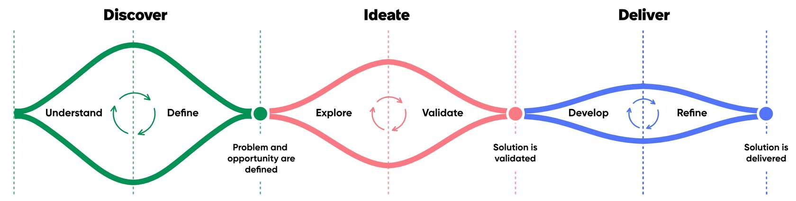
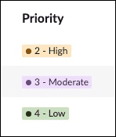
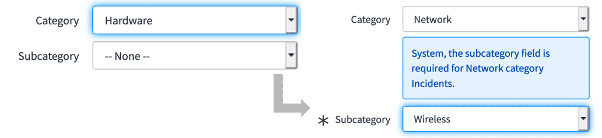

# Week 6 - Notizen

## Introduction to User Experience

Certified Technical Architects need to understand the principles and techniques of good user experience (UX). Collaborating with a UX specialist is essential to realize the actual user experience and to design a UX strategy that is both effective and sustainable.

## What is: UI, UX, and CX?

> **UI (User Interface), UX (User Experience), and CX (Customer Experience) are terms with different meanings that are sometimes used interchangeably. UI is about the appearance, UX is about the overall experience, and when these elements are successfully combined it results in a good CX.**

## Why is User Experience Important?

User experience refers to how people interact with a company, its services, and its products. In the digital world, user experience refers to everything that affects a user's interaction with a digital product.

### Why does user experience matter to the bottom line?

A well-developed user experience can significantly improve customer satisfaction and is clearly beneficial to business. Benefits of a great user experience:

- For every $1 invested in UX, organizations can expect a return of $100 (9,900% ROI). Source: dovetail.com/ux/ux-statistics
- By designing interfaces that are easy to understand and navigate, users can quickly learn how to use the system without extensive training — reducing time and resources spent on user education.
- Companies can significantly reduce support tickets by refining UX. Example: a change management platform saw a 40% reduction in support requests after redesigning its interface based on user feedback.

### Basic Principles of User Experience Design

Consider every element that shapes the user experience: how it makes users feel and how it helps them accomplish their tasks.

**Design thinking** is an approach to problem-solving that is user-centric, co-creative, experimental, and iterative. Focused on solving problems by understanding user needs, creating many possible solutions, testing them, and iterating until the best solution is found.

Three key components of design thinking: **Discover, Ideate, and Deliver.**

**Discover:** Get deep empathy to understand and define the problem. Meet your customers where they are and observe them to understand their problems, pain points, and aspirations. Define the customer problem and opportunity as clearly as possible.

**Ideate:** Go broad and explore ideas, then narrow on the best possible solution through validation. Generate lots of ideas and get customer feedback to narrow in on the solution that works best.

**Deliver:** Go through a process of rapid iteration to develop, test, and refine the solution to deliver the ideal outcome. Test prototypes to rapidly iterate before launch.

### Empathy

Empathy is essential to any user-centered design process because it helps designers move beyond their own assumptions and develop a deeper understanding of users and their needs.

By getting to know your users, you can:

- Acknowledge that you are not the user, and your perspective may not reflect their reality
- Actively listen to what users need to successfully complete their tasks
- Identify opportunities to reduce friction and increase productivity through thoughtful design
- Observe how users perform their work today to uncover pain points and gaps in the current experience
- Use tools like empathy maps to visualize users' thoughts, feelings, and behaviors, helping guide design decisions that truly meet their needs

### Validation

No design project is complete without user validation. This crucial step involves testing concepts with real users to gather feedback and determine whether the solution truly meets their needs.

- Gathering feedback early and often helps reduce costly rework later in the process
- Use low-cost prototypes to quickly test ideas with users before investing in full development
- Incorporate user feedback into each iteration and continue testing to refine the solution over time

### Reuse

Do not reinvent the wheel — consider if reuse is the appropriate next step. Benefits of reusing software:

- Can speed up system production because both development and validation time may be reduced
- Reusing UI/UX elements results in a consistent and common user experience, which aids adoption
- Fewer lines of code have to be recreated and written
- The cost of existing software is already known, whereas the cost of development is always a matter of judgment

> **Quiz**
> **Q:** Which of the following design-thinking components allows you to put your assumptions aside and understand the user's problems, pain points, and aspirations?
> **Options:**
> - Brainstorming
> - Empathy
> - Validation
> - Ideation
> **Correct:** Empathy
> **Erklärung:** Empathy is crucial to any human-centered design process as it allows us to set aside our own assumptions about the world and gain insight into users and their needs.

## Design Effective User Experiences

### User Experience Design Process

Each stage builds on the last, ensuring the design is grounded in real user needs.

**Early:** Spend time observing and speaking with users to understand how they complete their work. Ask:
- What challenges slow them down?
- What tools do they rely on most?
- How do they wish the process worked?

Combine interviews, surveys, and analytics to reveal trends and identify friction points.

**During:** Create low-fidelity prototypes to explore ideas and gather early feedback. Conduct usability studies to observe how users interact with your design — you will often uncover unexpected behaviors or pain points. Tip: 3-5 participants are usually enough to identify major usability issues.

**Later:** Continue testing as the solution evolves. Use analytics to track real-world behavior, and survey users to understand satisfaction and pain points. UX is iterative; each cycle refines the experience and increases adoption.

> **Tip: For easy access to much of this information, utilize the User Experience Analytics dashboard available for many Next Experience web and mobile applications.**

## Apply Insights to Interface Design

Once you've gathered insights, translate them into clear, usable interfaces. Good interface design focuses on making actions obvious, reducing friction, and ensuring users can accomplish tasks easily.

When multiple elements could work, prioritize clarity and simplicity over visual complexity. Consistency and predictability are key.

Effective design also focuses on choosing user interface elements that are consistent and predictable, as well as a layout to aid in task completion, efficiency, and satisfaction.

**Input Controls:**
- Buttons
- Text fields
- Checkboxes
- Radio buttons
- Dropdown lists
- List boxes
- Toggles
- Date fields

**Navigational Controls:**
- Breadcrumbs
- Slider
- Search field
- Pagination
- Tags
- Icons

**Informational Components:**
- Tooltips
- Icons
- Progress bar
- Notifications
- Message boxes
- Modal windows

### UI Design Leading Practices

- Keep the interface simple
- Create consistency and use common elements
- Design purposeful page layouts
- Use texture and color strategically
- Establish and follow clear typography hierarchy
- Provide system feedback to inform the user of status (location, actions, changes in state, errors)
- Place defaults thoughtfully to reduce user burden

## Interaction Design Essentials

Interaction design focuses on creating functionality-centric, engaging interfaces with well-thought-out behaviors. It anticipates how users might interact with the system, how to fix problems early, and how to invent new ways of doing things. Good interaction design feels natural — users can see what's possible and understand what will happen before they act.

**Define how users can interact with the interface**
- Direct manipulation: mouse, finger, stylus (pushing buttons, drag and drop, etc.)
- Indirect manipulation: keyboard shortcuts like Ctrl+C — commands not directly part of the product UI

**Give users clues about behavior before actions are taken**
- Affordances: appearance (color, shape, size) gives a clue about how an element functions
- Signifiers: information telling the user what will happen before they act — meaningful button labels, instructions before submission, etc.

**Anticipate and mitigate errors**
- Poka-Yoke ("mistake proofing") Principle: place constraints that force the user to adjust behavior to move forward with their intended action

**Consider system feedback and response time**
- System must respond to every action to acknowledge it and inform the user what it is doing
- Responsiveness (latency) levels: immediate (<0.1s), stammer (0.1-1s), interruption (1-10s), disruption (>10s)

**Strategically think about each element**
- Fitts' Law: elements like buttons need to be big enough to click — especially important on mobile with touch
- Fitts' Law (edges/corners): edges are good locations for menus and buttons because the mouse/finger cannot go beyond them
- Follow standards unless a new way genuinely improves upon them

**Simplify for learnability**
- Miller's Law: chunk information into 7 (±2) items — people can only hold 5-9 items in short-term memory
- Tesler's Law (Conservation of Complexity): remove as much complexity as possible from the user and build it into the system — but things can only be simplified to a certain point before they stop functioning
- Hick's Law: decision time is affected by how familiar the format is, how familiar users are with the choices, and the number of choices

**Design with accessibility in mind**
- Accessibility improves quality of experience for all users of varying abilities
- Resources:
  - Web accessibility guidelines: https://www.w3.org/WAI/standards-guidelines/wcag/
  - WAVE evaluation tool: https://chrome.google.com/webstore/detail/wave-evaluation-tool/jbbplnpkjmmeebjpijfedlgcdilocofh
  - ServiceNow product documentation for accessibility: https://www.servicenow.com/docs/bundle/accessibility/page/administer/accessibility-508-compliance/concept/available-accessibility-product-documentation.html
  - ServiceNow product accessibility: https://www.servicenow.com/docs/bundle/accessibility/page/administer/accessibility-508-compliance/concept/product_accessibility.html

> **Quiz**
> **Q:** What is a leading practice for designing clear and effective user interfaces?
> **Options:**
> - Use a varied color palette to create visual variety
> - Keep layouts consistent and focus on essential elements only
> - Avoid providing feedback to keep the interface uncluttered
> - Ensure interfaces are sparse and contain lots of white space
> **Correct:** Keep layouts consistent and focus on essential elements only
> **Erklärung:** Clear and effective interfaces provide the user with a consistent experience that does not overwhelm them with unnecessary options.

## ServiceNow UX Frameworks and Tools

### Now Experience Framework

Introduced to modernize the ServiceNow UI and provide a more seamless, consumer-grade experience. Allows developers to create consistent, responsive, and visually appealing interfaces across applications with reusable web components. ServiceNow provides over 150 baseline components; developers can also build custom ones.

The Now Experience Framework lets you:

- Create a single component to use in multiple places across applications
- Encapsulate the component's scope to prevent conflicts with other code
- Add properties, slots, and actions to components, allowing users to customize them in every workspace use
- Move away from third-party libraries to control APIs
- Allow ServiceNow to prioritize features, enhancements, and bug fixes to meet customer needs
- Reduce duplication efforts with reusable elements
- Ensure visual and functional consistency across ServiceNow platform products

**Now Design System:** Contains all necessary elements for developers and designers to design, realize, and build products — components, guidelines, API docs, playgrounds, and usage guidelines.

**UI Builder:** A WYSIWYG web UI builder that allows developers to build pages for workspace and custom portal experiences using components.

**ServiceNow CLI:** A command-line interface external to ServiceNow that allows developers to create, test, and upload components to a platform instance.
- Create project scaffolding (set of files required to develop a component)
- Start a local development server to test a component
- Build and deploy a component project to a ServiceNow instance
- Note: CLI is pro-code — use this method if the component is not available elsewhere.

**App Engine Studio:** A development tool for creators of varying skill levels to build applications on the Now Platform, including editing web experiences via UI Builder.

**Components:** The building blocks within the Design System for creating a user interface on the Now Experience Framework.

> **A foundational knowledge of web components is necessary for properly designing and building Now Experience Components. Resources: Web Fundamentals: https://web.dev/web-components/ | W3C specs: https://github.com/w3c/webcomponents**

### UI Builder

UI Builder is a WYSIWYG web user interface builder. Developers can use UI Builder to build and edit pages for web-based workspace and custom portal experiences using Now Experience components and custom web components.

### Access UI Builder

Two main ways to access UI Builder: launched on its own or from within App Engine Studio.

App Engine Studio is a development tool for building custom applications — separately licensed, but not required to use UI Builder.

Using UI Builder, you can:

- Toggle between experiences
- Set up and consume data resources
- Add components to pages by dragging and dropping
- Configure and style components
- Create client state variables
- Create and configure pages and properties
- Create client scripts
- Open the rendered version of your page
- Change application scopes and domains

### Form Builder

Form Builder is a drag-and-drop interface that enables users to design form layouts, create form views, add and configure form sections, and add fields from tables.

Form Builder simplifies form design for both non-developers and developers. Features:
- Live preview: real-time updates as the form layout is modified
- Reuse form templates or field groups across different forms to maintain consistency

> **Architects and developers responsible for designing interfaces should familiarise themselves with the Web Content Accessibility Guidelines (WCAG) 2.1. The ServiceNow Accessibility Statement outlines how ServiceNow is committed to continually improving accessibility.**
> - WCAG 2.1: https://www.w3.org/TR/WCAG21/
> - ServiceNow Accessibility Statement: https://www.servicenow.com/au/accessibility-statement.html

> **Quiz**
> **Q:** What is a key benefit of using UI Builder?
> **Options:**
> - It automatically generates scripts for all use cases
> - It is only accessible via App Engine Studio to developers
> - It allows drag-and-drop creation of pages using components
> - It does not require any understanding of web components
> **Correct:** It allows drag-and-drop creation of pages using components
> **Erklärung:** UI Builder supports drag-and-drop development of component-based pages.

## Design System

The Now Experience Design System comes with a set of customizable components that can be dragged and dropped into custom workspace UIs. The same components customers use to develop custom applications and webpages are used to develop ServiceNow products — ensuring everything looks like it belongs together.

### Cards

A card is a container for specific information in a simple, easily scannable format. Main purpose: help the user make a decision or quickly view information.

Five parts of a card:
- **Card container:** Container for subcomponents
- **Tagline:** String that identifies a set of content (optionally with an icon)
- **Card (header):** Summarizes the contents of a card
- **Content slot:** Container for a string
- **Card (action):** Provides actions within a card

Strive for simplicity — displaying too much information makes it challenging for the user to find information.

### Highlighted Values

Colors play a major role in creating a good user experience. A highlighted value component can display:
- An icon
- A label
- A background color

Use highlights to emphasize a status or to categorize and quickly identify related objects. Use colors consistently throughout your interface.

### Design System Examples

Pay attention to hints that aid consistent style and ease of access to information for the end user.

- Cards: show only concise snippets of information — do not display too much content in a card.
- Highlighted values: use to capture attention and reflect importance — do not use a low-priority color for something important.

> **Quiz**
> **Q:** When using a card component, what is a leading practice for displaying content?
> **Options:**
> - Display as much detail as possible for transparency
> - Keep content concise and scannable
> - Use long labels for clarity
> - Use multiple highlighted values per card for emphasis
> **Correct:** Keep content concise and scannable
> **Erklärung:** Cards should be minimal and easy to scan to support user decisions.

## Now Experience Components

Pre-built components are the building blocks of the Now Experience. Developers select from these via the Design System to build custom UIs.

Advantages of Now Experience components:
- Generic and flexible
- Built-in accessibility (WCAG 2.0)
- Desktop- and mobile-web ready
- Enable internationalization
- Compatible across multiple browser platforms

### Component Design

A component can be configured in different ways, but how it looks and behaves is consistent. Users expect the look and functionality to be consistent across pages — even when each instance is configured for specific capabilities. Examples of components leverage Design System principles to provide a more pleasant user experience to agents.

#### Component Examples

- **Avatar:** Graphical representation of a user — image, initials, or anonymous icon.
- **Card base actions:** Card subcomponent enabling the user to take action via one or more buttons.
- **Icon:** Graphic symbol representing an object or item.
- **Card footer:** Footer subcomponent for custom cards.
- **Iconic button:** Uses an icon instead of text to convey an action.
- **Playbook activity picker:** Displays activities in vertical orientation for a stage selected in the stage picker (horizontal view only).
- **Stepper:** Tabular navigation component that helps users visualize and interact with a multi-step process.
- **Card base divider:** Card subcomponent for visually separating sections within a card.

#### Component Development Example: Customer Requests

A customer's IT support team receives a high volume of inquiries related to service requests. To streamline their workflow, a component in the Contextual Side Panel surfaces all service requests associated with a specific contact along with relevant details.

Recommendation: custom GraphQL API returning all `sc_request` records linked to a contact's `sys_id`, along with related `sc_req_item` records and their catalog variable questions and answers. This ensures agents can view all necessary information in a single, efficient view.

## UX Design Considerations

### Considerations for Table Forms

Cultural differences can influence regional preferences for form layout. Form consideration checklist:

- Logical form layout
- Field data type
- Appropriate fields with clear labels
- Tooltips to offer guidance
- Feedback to users through message options
- Effective use of color (including accessibility)
- Logical groupings of fields in sections
- Hints, annotations, and UI policies (make mandatory, hide, set read-only)

Tools to incorporate these considerations:
- Data dictionary attributes
- Views and view rules
- UI policies
- Data policies
- Client scripts

### Client-Side Logic and Form Fatigue

Client-side logic monitors user input in real-time and knows exactly what is stored in the browser at any given moment — making it nimble and dynamic, often giving immediate feedback. Used for "just-in-time" training, UX improvements, and lightweight field validation or automation. Limitation: only knows data in the browser, not related information on the server.

If client-side logic needs server-side data, it must call the server. Display business rules can proactively prevent unnecessary server calls by giving client-side scripts the information they need ahead of time.

> **Using GlideAJAX is the best option for making fast, dynamic, asynchronous calls to the server.**

### Universal Request

ServiceNow Universal Request empowers customers in their journey towards Enterprise Service Management (ESM) or Global Business Services (GBS) by allowing agents to resolve cases seamlessly across the enterprise — providing a better employee experience.

Universal Request improves UX by streamlining how employees report and resolve issues across IT, HR, Facilities, and Legal:

- **One entry point for all requests:** Users submit one universal request; the system routes it to the appropriate team (HR vs. IT). No need to guess where to go.
- **Case handover across departments:** If a request moves between departments (e.g., HR to IT), the handover is seamless and invisible to the user — no re-explaining required.
- **Support for ESM:** Helps organizations move toward a unified service experience, supporting cross-functional collaboration and improving internal service delivery.

> **Quiz**
> **Q:** Which of the following enhances form usability for diverse user audiences? Select all that apply.
> **Options:**
> - Logical form layout
> - Effective use of color
> - Using technical field names visible to users
> - Clear field labelling
> - Complex dropdown navigation
> - Logical groupings of fields in sections
> **Correct:** Logical form layout, Effective use of color, Clear field labelling, Logical groupings of fields in sections
> **Erklärung:** Designing for usability involves presenting clear, accessible, and well-structured interfaces. Complex dropdowns and exposing technical field names can confuse users and negatively affect the experience.

## Summary — Key Takeaways

**Takeaway 1:** Understand key UX principles — research, empathy, and validation are essential for effective design. A thoughtful UX approach reduces rework and improves adoption.

**Takeaway 2:** Use ServiceNow frameworks and tools — the Now Experience Framework, UI Builder, and Form Builder simplify creating modern, reusable interfaces, accelerate delivery, and maintain upgradeability.

**Takeaway 3:** Optimize with pre-built components — use the ServiceNow library of configurable components to ensure design consistency, reduce custom code, and streamline development. Supports accessibility and long-term platform health.

### Additional Resources

- [From the Experts: The Value of UX](https://learning.servicenow.com/lxp/en/now-platform/from-the-experts-the-value-of-user-experience-ux?id=learning_course_prev&course_id=7f5c1a57831e6510ec0ea230ceaad3ad) — ServiceNow University course
- [From the Experts: UX Leading Practices](https://learning.servicenow.com/lxp/en/now-platform/from-the-experts-user-experience-ux-leading-practices?course_id=227c925bc3d6a51020a3be3ed40131cf&id=learning_course_prev) — ServiceNow University course
- [UI Design Principles — Best Practices](https://visualhierarchy.co/user-interface-design-best-practices) — Web page
- [Next Experience Center of Excellence](https://www.servicenow.com/community/next-experience-articles/next-experience-center-of-excellence/ta-p/2332092) — ServiceNow Community
- [UI Builder Fundamentals](https://learning.servicenow.com/lxp/en/now-platform/ui-builder-fundamentals-washington?id=learning_course_prev&course_id=be3c198e97bf5ed4a916b4be2153af4b) — ServiceNow University course
- [Introduction to External Component Development](https://learning.servicenow.com/lxp/en/now-platform/introduction-to-external-component-development?id=learning_course_prev&course_id=5343d47d873f16d8e6ba74c7dabb3500) — ServiceNow University course
- [Next Experience Components](https://developer.servicenow.com/dev.do#!/reference/next-experience/components) — ServiceNow Developer site
