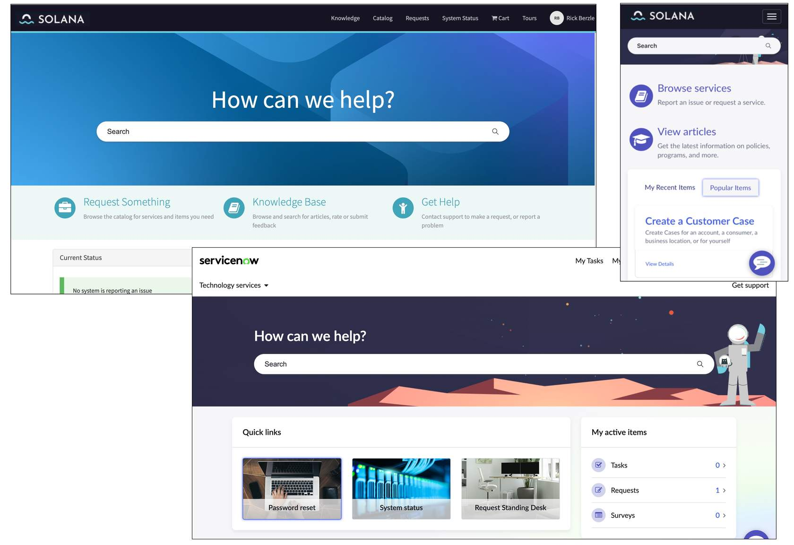
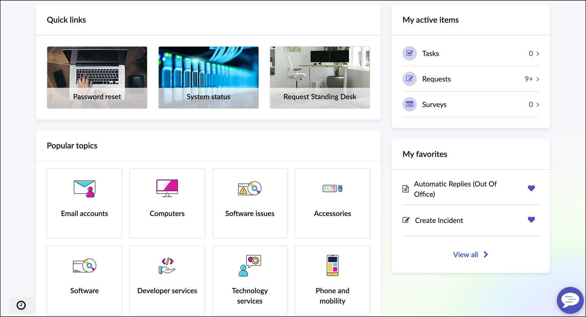
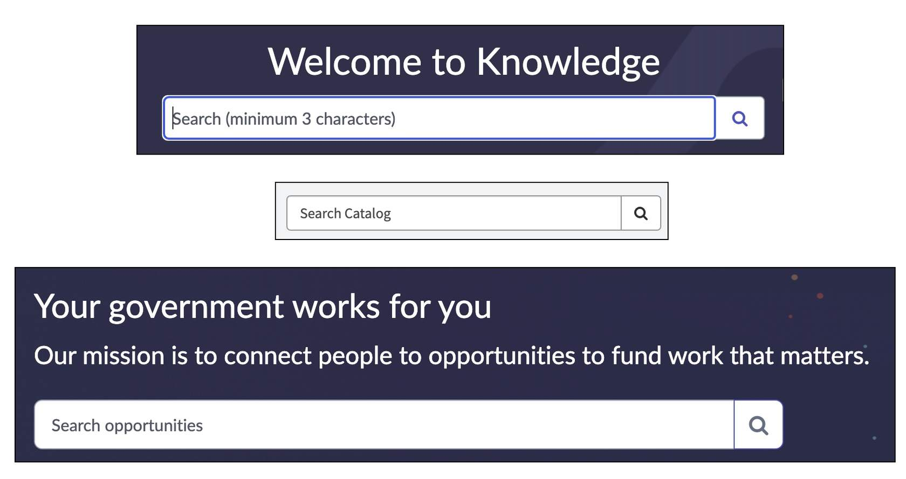
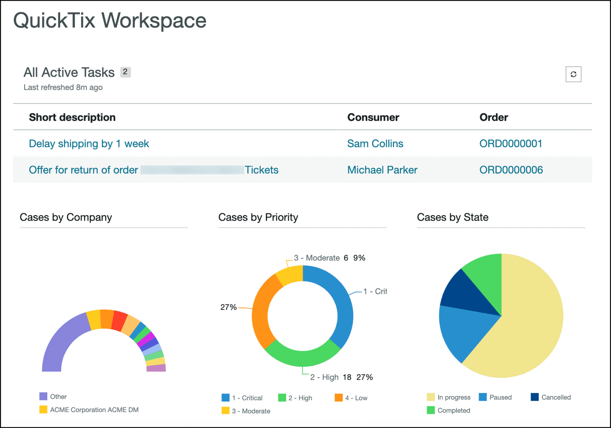
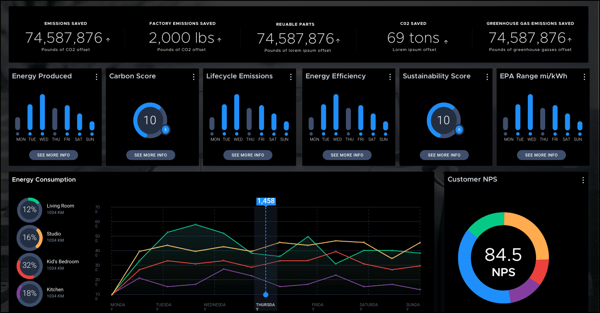

# Week 6 - Notizen

## Introduction to User Experience

Certified Technical Architects need to understand the principles and techniques of good user experience (UX). Collaborating with a UX specialist is essential to realize the actual user experience and to design a UX strategy that is both effective and sustainable.

## What is: UI, UX, and CX?

> **UI (User Interface), UX (User Experience), and CX (Customer Experience) are terms with different meanings that are sometimes used interchangeably. UI is about the appearance, UX is about the overall experience, and when these elements are successfully combined it results in a good CX.**

## Why is User Experience Important?

User experience refers to how people interact with a company, its services, and its products. In the digital world, user experience refers to everything that affects a user's interaction with a digital product.

### Why does user experience matter to the bottom line?

A well-developed user experience can significantly improve customer satisfaction and is clearly beneficial to business. Benefits of a great user experience:

- For every $1 invested in UX, organizations can expect a return of $100 (9,900% ROI). Source: dovetail.com/ux/ux-statistics
- By designing interfaces that are easy to understand and navigate, users can quickly learn how to use the system without extensive training — reducing time and resources spent on user education.
- Companies can significantly reduce support tickets by refining UX. Example: a change management platform saw a 40% reduction in support requests after redesigning its interface based on user feedback.

### Basic Principles of User Experience Design

Consider every element that shapes the user experience: how it makes users feel and how it helps them accomplish their tasks.

**Design thinking** is an approach to problem-solving that is user-centric, co-creative, experimental, and iterative. Focused on solving problems by understanding user needs, creating many possible solutions, testing them, and iterating until the best solution is found.

Three key components of design thinking: **Discover, Ideate, and Deliver.**

**Discover:** Get deep empathy to understand and define the problem. Meet your customers where they are and observe them to understand their problems, pain points, and aspirations. Define the customer problem and opportunity as clearly as possible.

**Ideate:** Go broad and explore ideas, then narrow on the best possible solution through validation. Generate lots of ideas and get customer feedback to narrow in on the solution that works best.

**Deliver:** Go through a process of rapid iteration to develop, test, and refine the solution to deliver the ideal outcome. Test prototypes to rapidly iterate before launch.

### Empathy

Empathy is essential to any user-centered design process because it helps designers move beyond their own assumptions and develop a deeper understanding of users and their needs.

By getting to know your users, you can:

- Acknowledge that you are not the user, and your perspective may not reflect their reality
- Actively listen to what users need to successfully complete their tasks
- Identify opportunities to reduce friction and increase productivity through thoughtful design
- Observe how users perform their work today to uncover pain points and gaps in the current experience
- Use tools like empathy maps to visualize users' thoughts, feelings, and behaviors, helping guide design decisions that truly meet their needs

### Validation

No design project is complete without user validation. This crucial step involves testing concepts with real users to gather feedback and determine whether the solution truly meets their needs.

- Gathering feedback early and often helps reduce costly rework later in the process
- Use low-cost prototypes to quickly test ideas with users before investing in full development
- Incorporate user feedback into each iteration and continue testing to refine the solution over time

### Reuse

Do not reinvent the wheel — consider if reuse is the appropriate next step. Benefits of reusing software:

- Can speed up system production because both development and validation time may be reduced
- Reusing UI/UX elements results in a consistent and common user experience, which aids adoption
- Fewer lines of code have to be recreated and written
- The cost of existing software is already known, whereas the cost of development is always a matter of judgment

> **Quiz**
> **Q:** Which of the following design-thinking components allows you to put your assumptions aside and understand the user's problems, pain points, and aspirations?
> **Options:**
> - Brainstorming
> - Empathy
> - Validation
> - Ideation
> **Correct:** Empathy
> **Erklärung:** Empathy is crucial to any human-centered design process as it allows us to set aside our own assumptions about the world and gain insight into users and their needs.

## Design Effective User Experiences

### User Experience Design Process

Each stage builds on the last, ensuring the design is grounded in real user needs.

**Early:** Spend time observing and speaking with users to understand how they complete their work. Ask:
- What challenges slow them down?
- What tools do they rely on most?
- How do they wish the process worked?

Combine interviews, surveys, and analytics to reveal trends and identify friction points.

**During:** Create low-fidelity prototypes to explore ideas and gather early feedback. Conduct usability studies to observe how users interact with your design — you will often uncover unexpected behaviors or pain points. Tip: 3-5 participants are usually enough to identify major usability issues.

**Later:** Continue testing as the solution evolves. Use analytics to track real-world behavior, and survey users to understand satisfaction and pain points. UX is iterative; each cycle refines the experience and increases adoption.

> **Tip: For easy access to much of this information, utilize the User Experience Analytics dashboard available for many Next Experience web and mobile applications.**

## Apply Insights to Interface Design

Once you've gathered insights, translate them into clear, usable interfaces. Good interface design focuses on making actions obvious, reducing friction, and ensuring users can accomplish tasks easily.

When multiple elements could work, prioritize clarity and simplicity over visual complexity. Consistency and predictability are key.

Effective design also focuses on choosing user interface elements that are consistent and predictable, as well as a layout to aid in task completion, efficiency, and satisfaction.

**Input Controls:**
- Buttons
- Text fields
- Checkboxes
- Radio buttons
- Dropdown lists
- List boxes
- Toggles
- Date fields

**Navigational Controls:**
- Breadcrumbs
- Slider
- Search field
- Pagination
- Tags
- Icons

**Informational Components:**
- Tooltips
- Icons
- Progress bar
- Notifications
- Message boxes
- Modal windows

### UI Design Leading Practices

- Keep the interface simple
- Create consistency and use common elements
- Design purposeful page layouts
- Use texture and color strategically
- Establish and follow clear typography hierarchy
- Provide system feedback to inform the user of status (location, actions, changes in state, errors)
- Place defaults thoughtfully to reduce user burden

## Interaction Design Essentials

Interaction design focuses on creating functionality-centric, engaging interfaces with well-thought-out behaviors. It anticipates how users might interact with the system, how to fix problems early, and how to invent new ways of doing things. Good interaction design feels natural — users can see what's possible and understand what will happen before they act.

**Define how users can interact with the interface**
- Direct manipulation: mouse, finger, stylus (pushing buttons, drag and drop, etc.)
- Indirect manipulation: keyboard shortcuts like Ctrl+C — commands not directly part of the product UI

**Give users clues about behavior before actions are taken**
- Affordances: appearance (color, shape, size) gives a clue about how an element functions
- Signifiers: information telling the user what will happen before they act — meaningful button labels, instructions before submission, etc.

**Anticipate and mitigate errors**
- Poka-Yoke ("mistake proofing") Principle: place constraints that force the user to adjust behavior to move forward with their intended action

**Consider system feedback and response time**
- System must respond to every action to acknowledge it and inform the user what it is doing
- Responsiveness (latency) levels: immediate (<0.1s), stammer (0.1-1s), interruption (1-10s), disruption (>10s)

**Strategically think about each element**
- Fitts' Law: elements like buttons need to be big enough to click — especially important on mobile with touch
- Fitts' Law (edges/corners): edges are good locations for menus and buttons because the mouse/finger cannot go beyond them
- Follow standards unless a new way genuinely improves upon them

**Simplify for learnability**
- Miller's Law: chunk information into 7 (±2) items — people can only hold 5-9 items in short-term memory
- Tesler's Law (Conservation of Complexity): remove as much complexity as possible from the user and build it into the system — but things can only be simplified to a certain point before they stop functioning
- Hick's Law: decision time is affected by how familiar the format is, how familiar users are with the choices, and the number of choices

**Design with accessibility in mind**
- Accessibility improves quality of experience for all users of varying abilities
- Resources:
  - Web accessibility guidelines: https://www.w3.org/WAI/standards-guidelines/wcag/
  - WAVE evaluation tool: https://chrome.google.com/webstore/detail/wave-evaluation-tool/jbbplnpkjmmeebjpijfedlgcdilocofh
  - ServiceNow product documentation for accessibility: https://www.servicenow.com/docs/bundle/accessibility/page/administer/accessibility-508-compliance/concept/available-accessibility-product-documentation.html
  - ServiceNow product accessibility: https://www.servicenow.com/docs/bundle/accessibility/page/administer/accessibility-508-compliance/concept/product_accessibility.html

> **Quiz**
> **Q:** What is a leading practice for designing clear and effective user interfaces?
> **Options:**
> - Use a varied color palette to create visual variety
> - Keep layouts consistent and focus on essential elements only
> - Avoid providing feedback to keep the interface uncluttered
> - Ensure interfaces are sparse and contain lots of white space
> **Correct:** Keep layouts consistent and focus on essential elements only
> **Erklärung:** Clear and effective interfaces provide the user with a consistent experience that does not overwhelm them with unnecessary options.

## ServiceNow UX Frameworks and Tools

### Now Experience Framework

Introduced to modernize the ServiceNow UI and provide a more seamless, consumer-grade experience. Allows developers to create consistent, responsive, and visually appealing interfaces across applications with reusable web components. ServiceNow provides over 150 baseline components; developers can also build custom ones.

The Now Experience Framework lets you:

- Create a single component to use in multiple places across applications
- Encapsulate the component's scope to prevent conflicts with other code
- Add properties, slots, and actions to components, allowing users to customize them in every workspace use
- Move away from third-party libraries to control APIs
- Allow ServiceNow to prioritize features, enhancements, and bug fixes to meet customer needs
- Reduce duplication efforts with reusable elements
- Ensure visual and functional consistency across ServiceNow platform products

**Now Design System:** Contains all necessary elements for developers and designers to design, realize, and build products — components, guidelines, API docs, playgrounds, and usage guidelines.

**UI Builder:** A WYSIWYG web UI builder that allows developers to build pages for workspace and custom portal experiences using components.

**ServiceNow CLI:** A command-line interface external to ServiceNow that allows developers to create, test, and upload components to a platform instance.
- Create project scaffolding (set of files required to develop a component)
- Start a local development server to test a component
- Build and deploy a component project to a ServiceNow instance
- Note: CLI is pro-code — use this method if the component is not available elsewhere.

**App Engine Studio:** A development tool for creators of varying skill levels to build applications on the Now Platform, including editing web experiences via UI Builder.

**Components:** The building blocks within the Design System for creating a user interface on the Now Experience Framework.

> **A foundational knowledge of web components is necessary for properly designing and building Now Experience Components. Resources: Web Fundamentals: https://web.dev/web-components/ | W3C specs: https://github.com/w3c/webcomponents**

### UI Builder

UI Builder is a WYSIWYG web user interface builder. Developers can use UI Builder to build and edit pages for web-based workspace and custom portal experiences using Now Experience components and custom web components.

### Access UI Builder

Two main ways to access UI Builder: launched on its own or from within App Engine Studio.

App Engine Studio is a development tool for building custom applications — separately licensed, but not required to use UI Builder.

Using UI Builder, you can:

- Toggle between experiences
- Set up and consume data resources
- Add components to pages by dragging and dropping
- Configure and style components
- Create client state variables
- Create and configure pages and properties
- Create client scripts
- Open the rendered version of your page
- Change application scopes and domains

### Form Builder

Form Builder is a drag-and-drop interface that enables users to design form layouts, create form views, add and configure form sections, and add fields from tables.

Form Builder simplifies form design for both non-developers and developers. Features:
- Live preview: real-time updates as the form layout is modified
- Reuse form templates or field groups across different forms to maintain consistency

> **Architects and developers responsible for designing interfaces should familiarise themselves with the Web Content Accessibility Guidelines (WCAG) 2.1. The ServiceNow Accessibility Statement outlines how ServiceNow is committed to continually improving accessibility.**
> - WCAG 2.1: https://www.w3.org/TR/WCAG21/
> - ServiceNow Accessibility Statement: https://www.servicenow.com/au/accessibility-statement.html

> **Quiz**
> **Q:** What is a key benefit of using UI Builder?
> **Options:**
> - It automatically generates scripts for all use cases
> - It is only accessible via App Engine Studio to developers
> - It allows drag-and-drop creation of pages using components
> - It does not require any understanding of web components
> **Correct:** It allows drag-and-drop creation of pages using components
> **Erklärung:** UI Builder supports drag-and-drop development of component-based pages.

## Design System

The Now Experience Design System comes with a set of customizable components that can be dragged and dropped into custom workspace UIs. The same components customers use to develop custom applications and webpages are used to develop ServiceNow products — ensuring everything looks like it belongs together.

### Cards

A card is a container for specific information in a simple, easily scannable format. Main purpose: help the user make a decision or quickly view information.

Five parts of a card:
- **Card container:** Container for subcomponents
- **Tagline:** String that identifies a set of content (optionally with an icon)
- **Card (header):** Summarizes the contents of a card
- **Content slot:** Container for a string
- **Card (action):** Provides actions within a card

Strive for simplicity — displaying too much information makes it challenging for the user to find information.

### Highlighted Values

Colors play a major role in creating a good user experience. A highlighted value component can display:
- An icon
- A label
- A background color

Use highlights to emphasize a status or to categorize and quickly identify related objects. Use colors consistently throughout your interface.

### Design System Examples

Pay attention to hints that aid consistent style and ease of access to information for the end user.

- Cards: show only concise snippets of information — do not display too much content in a card.
- Highlighted values: use to capture attention and reflect importance — do not use a low-priority color for something important.

> **Quiz**
> **Q:** When using a card component, what is a leading practice for displaying content?
> **Options:**
> - Display as much detail as possible for transparency
> - Keep content concise and scannable
> - Use long labels for clarity
> - Use multiple highlighted values per card for emphasis
> **Correct:** Keep content concise and scannable
> **Erklärung:** Cards should be minimal and easy to scan to support user decisions.

## Now Experience Components

Pre-built components are the building blocks of the Now Experience. Developers select from these via the Design System to build custom UIs.

Advantages of Now Experience components:
- Generic and flexible
- Built-in accessibility (WCAG 2.0)
- Desktop- and mobile-web ready
- Enable internationalization
- Compatible across multiple browser platforms

### Component Design

A component can be configured in different ways, but how it looks and behaves is consistent. Users expect the look and functionality to be consistent across pages — even when each instance is configured for specific capabilities. Examples of components leverage Design System principles to provide a more pleasant user experience to agents.

#### Component Examples

- **Avatar:** Graphical representation of a user — image, initials, or anonymous icon.
- **Card base actions:** Card subcomponent enabling the user to take action via one or more buttons.
- **Icon:** Graphic symbol representing an object or item.
- **Card footer:** Footer subcomponent for custom cards.
- **Iconic button:** Uses an icon instead of text to convey an action.
- **Playbook activity picker:** Displays activities in vertical orientation for a stage selected in the stage picker (horizontal view only).
- **Stepper:** Tabular navigation component that helps users visualize and interact with a multi-step process.
- **Card base divider:** Card subcomponent for visually separating sections within a card.

#### Component Development Example: Customer Requests

A customer's IT support team receives a high volume of inquiries related to service requests. To streamline their workflow, a component in the Contextual Side Panel surfaces all service requests associated with a specific contact along with relevant details.

Recommendation: custom GraphQL API returning all `sc_request` records linked to a contact's `sys_id`, along with related `sc_req_item` records and their catalog variable questions and answers. This ensures agents can view all necessary information in a single, efficient view.

## UX Design Considerations

### Considerations for Table Forms

Cultural differences can influence regional preferences for form layout. Form consideration checklist:

- Logical form layout
- Field data type
- Appropriate fields with clear labels
- Tooltips to offer guidance
- Feedback to users through message options
- Effective use of color (including accessibility)
- Logical groupings of fields in sections
- Hints, annotations, and UI policies (make mandatory, hide, set read-only)

Tools to incorporate these considerations:
- Data dictionary attributes
- Views and view rules
- UI policies
- Data policies
- Client scripts

### Client-Side Logic and Form Fatigue

Client-side logic monitors user input in real-time and knows exactly what is stored in the browser at any given moment — making it nimble and dynamic, often giving immediate feedback. Used for "just-in-time" training, UX improvements, and lightweight field validation or automation. Limitation: only knows data in the browser, not related information on the server.

If client-side logic needs server-side data, it must call the server. Display business rules can proactively prevent unnecessary server calls by giving client-side scripts the information they need ahead of time.

> **Using GlideAJAX is the best option for making fast, dynamic, asynchronous calls to the server.**

### Universal Request

ServiceNow Universal Request empowers customers in their journey towards Enterprise Service Management (ESM) or Global Business Services (GBS) by allowing agents to resolve cases seamlessly across the enterprise — providing a better employee experience.

Universal Request improves UX by streamlining how employees report and resolve issues across IT, HR, Facilities, and Legal:

- **One entry point for all requests:** Users submit one universal request; the system routes it to the appropriate team (HR vs. IT). No need to guess where to go.
- **Case handover across departments:** If a request moves between departments (e.g., HR to IT), the handover is seamless and invisible to the user — no re-explaining required.
- **Support for ESM:** Helps organizations move toward a unified service experience, supporting cross-functional collaboration and improving internal service delivery.

> **Quiz**
> **Q:** Which of the following enhances form usability for diverse user audiences? Select all that apply.
> **Options:**
> - Logical form layout
> - Effective use of color
> - Using technical field names visible to users
> - Clear field labelling
> - Complex dropdown navigation
> - Logical groupings of fields in sections
> **Correct:** Logical form layout, Effective use of color, Clear field labelling, Logical groupings of fields in sections
> **Erklärung:** Designing for usability involves presenting clear, accessible, and well-structured interfaces. Complex dropdowns and exposing technical field names can confuse users and negatively affect the experience.

## Summary — Key Takeaways

**Takeaway 1:** Understand key UX principles — research, empathy, and validation are essential for effective design. A thoughtful UX approach reduces rework and improves adoption.

**Takeaway 2:** Use ServiceNow frameworks and tools — the Now Experience Framework, UI Builder, and Form Builder simplify creating modern, reusable interfaces, accelerate delivery, and maintain upgradeability.

**Takeaway 3:** Optimize with pre-built components — use the ServiceNow library of configurable components to ensure design consistency, reduce custom code, and streamline development. Supports accessibility and long-term platform health.

### Additional Resources

- [From the Experts: The Value of UX](https://learning.servicenow.com/lxp/en/now-platform/from-the-experts-the-value-of-user-experience-ux?id=learning_course_prev&course_id=7f5c1a57831e6510ec0ea230ceaad3ad) — ServiceNow University course
- [From the Experts: UX Leading Practices](https://learning.servicenow.com/lxp/en/now-platform/from-the-experts-user-experience-ux-leading-practices?course_id=227c925bc3d6a51020a3be3ed40131cf&id=learning_course_prev) — ServiceNow University course
- [UI Design Principles — Best Practices](https://visualhierarchy.co/user-interface-design-best-practices) — Web page
- [Next Experience Center of Excellence](https://www.servicenow.com/community/next-experience-articles/next-experience-center-of-excellence/ta-p/2332092) — ServiceNow Community
- [UI Builder Fundamentals](https://learning.servicenow.com/lxp/en/now-platform/ui-builder-fundamentals-washington?id=learning_course_prev&course_id=be3c198e97bf5ed4a916b4be2153af4b) — ServiceNow University course
- [Introduction to External Component Development](https://learning.servicenow.com/lxp/en/now-platform/introduction-to-external-component-development?id=learning_course_prev&course_id=5343d47d873f16d8e6ba74c7dabb3500) — ServiceNow University course
- [Next Experience Components](https://developer.servicenow.com/dev.do#!/reference/next-experience/components) — ServiceNow Developer site

## ServiceNow Portal overview

A well-designed portal helps users ask questions and find the answers they need, complete tasks assigned to them with ease, and submit requests for the goods and services they need. A Service Portal offers an alternative user experience to the standard platform UI.

### What a Service Portal Is

- A collection of pages offering users an engaging way to access applications, information, services, and tasks
- A visual layer that transforms the look and feel of ServiceNow and brings information together in a uniform way
- Easy to use on any device and easy to configure, customize, and extend

### Unsupported Features in ServiceNow Portals

Elements of the portal design platform, such as settings, portals, pages, and widgets, are not domain-separated. However, widget data is displayed when based on the appropriate domain. To provide different experiences, administrators should create separate service portals, each with unique URLs, and redirect users accordingly.

### Portal Administrators and Developers

Portals were designed so that even users with limited coding ability or limited knowledge of the platform UI can set up a portal.

Users with an understanding of the ServiceNow platform can create portals, set up URL redirects, and view all portal components in tables. Most configuration takes place on the portal configuration page, but in specific situations administrators may need to perform additional setup directly in the platform.

#### No-code administrators

**Role:** Portal Administrators

- Comfortable performing drag-and-drop web development
- Easily apply company branding

#### Low-code administrators

**Role:** ServiceNow Administrators

- Comfortable modifying existing portal elements, activating plugins, and configuring ServiceNow
- Experience with HTML, CSS, and core Bootstrap concepts

#### Pro-code administrators

**Role:** ServiceNow Developers

- Comfortable creating new portal elements using AngularJS and ServiceNow APIs
- Experience with HTML, CSS, Bootstrap, ServiceNow scripting, JavaScript, and AngularJS

### Out-of-the-box Portals

There are numerous portals available out of the box. Check existing options and available plugins before building a new one. The following table outlines some out-of-the-box portals and the suffixes used to access them.

| Portal name | URL suffix |
| --- | --- |
| CAB Workbench | cab |
| Mobile Employee Service Portal | mesp |
| Knowledge Portal | kb |
| Customer Support | csm |
| Vendor Portal - Scoped | svdp |
| Government Service Portal | gsp |
| Benchmarks | benchmarks |
| Employee Center | esc |
| Service Portal | sp |
| Instance Security Center | isc |
| Workplace Services | ws |
| SP Configuration | sp_config |
| Service Workspace Portal | swp |

> **Note: The portals available on an instance depend on the plugins installed. The full list of portals available on an instance and the suffixes used to access them can be located by going to All > Service Portal > Portals.**

> **Access ServiceNow University for additional training on Service Portal: Service Portal Fundamentals and Service Portal Advanced On Demand.**

https://learning.service-now.com/lxp?id=learning_course_prev&course_id=ae383a8cdb5eff40de3cdb85ca9619bd
https://learning.servicenow.com/lxp/en/now-platform/service-portal-advanced-on-demand-washington?id=learning_course_prev&course_id=6e27b6eb473822d09844c1c4f16d437c&s=1&ssa=3

### Employee Center and Employee Center Pro

Careful consideration should be given to the design of the Employee Center portal to help employees seek assistance, self-serve through the knowledge base, and complete tasks, approvals, and other to-do items.

Employee Center provides an intuitive and user-friendly interface to access employee-related services offered by an organization. The Employee Center portal enables organizations to scale service solutions across departments such as IT, HR, Workplace, Legal, and Procurement through digital workflows.

Employee Center Pro is a premium licensed extension of Employee Center that adds enhanced capabilities for communication, engagement, analytics, deeper integrations, and targeted content.

Employees can:

- Access information and services organized within knowledge bases, catalogs, forums, and Virtual Agent
- Access employee self-service anytime and anywhere through responsive design for PC, laptop, tablet, and mobile devices
- Engage in case management by opening, monitoring, and acting on cases and tasks

Employers can:

- Share information on organizational imperatives, announcements, and targeted campaigns
- Assign required actions through to-dos (approvals and other tasks)
- Engage co-workers in community forums and discussions

### Employee Center Pro Overview

Watch the video to learn more about ServiceNow Employee Center Pro.

https://www.youtube.com/watch?v=P9zue5YIdwM

> **Quiz**
> **Q:** What can users access from a portal page?
> **Options:**
> - Applications
> - Information
> - Services
> - Tasks
> - All of the above
> **Correct:** All of the above
> **Erklärung:** Service Portal is a collection of pages offering users an engaging way to access applications, information, services, and tasks.

## Portal content architecture

> “When a user has an easy time finding what they are looking for, you reduce the total amount of effort they need to invest interacting with a product.”
>
> ~ Adobe UX Specialist

### Content and information architecture

Content architecture is a UX discipline that focuses on organizing and labeling content so it is easy to find, understand, and use. It combines strategy and structure to present content in a logical and user-friendly way. Closely related to Information Architecture (IA), it supports users in locating information and completing tasks efficiently.

Both content architecture and information architecture ensure that the right content is available in the right place, at the right time, in the right format, for the right audience.

### Users

- Identify your audience and understand their needs, behaviors, and experiences before structuring self-service applications
- Let user insights guide decision-making throughout the design process
- Conduct thorough research and usability testing to observe how people interact with self-service tools
- Use these findings to optimize application structure and functionality

### Content

- Recognize that content is the core of every knowledge base, service portal, and service catalog
- Provide meaningful content users can read, access, or use to complete tasks and find information
- Assess the nature, volume, and expected growth of content to guide design and maintenance
- Structure applications so users can easily interact with content, stay engaged, and increase conversions
- Deliver content users find valuable and make it easy to locate through strong organization and search
- Prevent frustration by making key information immediately accessible, otherwise users may abandon the portal
- Build a strong information architecture to support structure and usability across knowledge bases, portals, and catalogs

### Context

- Define the context in which information is provided to the audience
- Consider business goals, vision, mission, and target market when planning content and structure
- Account for influencing factors such as funding, politics, culture, technology, available resources, and constraints
- Use this context to guide how self-service applications are structured and delivered

### Content strategy basics

Content strategy focuses on the planning, creation, delivery, and governance of content. The goal is to create meaningful, cohesive, engaging, and sustainable content that is well-structured and easy to find. It also helps identify what already exists, what should be created, and why it should be created.

Review guidelines that contribute to strong content-oriented and people-oriented components.

#### Content-oriented components

**Identify goals and substance**

Focuses on what content is required to successfully execute an organization's core strategy. It includes messaging architecture, intended audience(s), and voice and tone.

**Determine structure**

Focuses on how content is prioritized, organized, and accessed. Consider the content itself, including mapping messages to content, content bridging, and creating detailed page tables.

#### Content lifecycle overview

Good content architecture starts with thorough user research. Identify your audience early and involve users from the beginning. Continually maintain and update content based on evolving user needs.

After listing all content, prioritize and group it logically. One effective technique for early insights is card sorting, introduced in User Experience Part 1. Card sorting helps design and evaluate content architecture by showing how users naturally categorize content.

During a session, participants group topics in ways that make sense to them and may suggest useful labels. This supports the structure of the knowledge base, service portal, and service catalog so they align with user thinking. Card sorting is one of many research methods that help build user-informed architecture.

#### People-oriented components

**Outline roles and workflow**

Focuses on how people manage and maintain content daily, including roles, tasks, and tools required across the content lifecycle.

**Identify policies and standards**

Focuses on the policies, standards, and guidelines that apply to content and its lifecycle, as well as how the organization sustains and evolves its content strategy.

### Content lifecycle

#### Step 1: Audit and analysis

- **Conduct content stakeholder interviews:** Engage key stakeholders to understand strategic goals, content requirements, and user expectations.
- **Perform competitive analysis:** Study how competitors structure and present similar content across websites, portals, knowledge bases, and service catalogs to identify best practices, trends, and usability standards.
- **Analyze and evaluate the current content environment:** Audit existing content across platforms to assess quality, relevance, accuracy, and usability. Identify outdated information, duplication, and structural inconsistencies.

#### Step 2: Strategy

- **Define ownership and governance:** Establish clear ownership for each content area or topic to ensure accountability.
- **Develop and align taxonomy:** Create a structured taxonomy that reflects how users search and navigate content.
- **Establish content workflow and production process:** Design a repeatable and efficient workflow for planning, creating, reviewing, and publishing content.
- **Create a sourcing and maintenance plan:** Identify reliable internal and external content sources and define ongoing update plans.
- **Define voice, tone, and brand guidelines:** Articulate the desired voice and tone for consistent user experience across channels.
- **Set success metrics and evaluation criteria:** Determine how effectiveness is measured, such as engagement, search success rate, task completion, or user satisfaction.

#### Step 3: Plan

- **Staffing and resourcing recommendations:** Identify roles needed for ongoing operations, including content strategists, editors, information architects, and administrators.
- **Content Management System (CMS) configuration:** Configure the CMS to support content strategy, taxonomy, workflow, and metadata requirements.
- **Metadata and tagging framework:** Develop a standardized metadata approach to improve discoverability, searchability, and reporting.
- **Communications and change management plan:** Create a plan to communicate purpose, process, and impact of content strategy to stakeholders and users.
- **Content migration and transition plan:** Define migration approach for existing content, including audit, archive/revise/migrate decisions, and mapping to new taxonomy, metadata, and structure.

#### Step 4: Create

- **Content and asset creation:** Develop high-quality, user-centered content based on defined voice, tone, and taxonomy.
- **Implement governance and workflow models:** Apply the established governance model to guide development and maintenance.
- **Optimize content for search (SEO):** Use SEO best practices during creation, including relevant keywords, clear titles and descriptions, and structured metadata.
- **Conduct quality assurance:** Integrate quality checks into the content workflow.
- **Enable analytics and performance tracking:** Configure analytics to measure effectiveness against success criteria, including page views, search performance, engagement, and task completion.

#### Step 5: Maintain

- **Establish a content audit and review cycle:** Plan regular audits for accuracy, relevance, and alignment with user and business needs.
- **Measure content against success metrics:** Continuously track performance using strategy-defined criteria.
- **Drive continuous improvement:** Use findings from audits, analytics, and stakeholder feedback to improve content iteratively.

### Content creation leading practices

**General**

- Understand the organization's goals and user needs to create meaningful and relevant content
- Follow style guides for language and design to aid in learning and understanding
- Understand how users think and speak about a topic area/subject
- Communicate to people in a way that they understand

**Content**

- Be purposeful in the content to include or exclude
- Content is consistently updated when available, otherwise, it is archived
- Content is accessible and users benefit from the information
- Content can be found whether internally, externally, or both
- Content defines requirements in overall design and structure

> **Quiz**
> **Q:** What are the components that can help you create a successful content strategy?
> **Options:**
> - Content-oriented
> - Solution-oriented
> - Task-oriented
> - People-oriented
> **Correct:** Content-oriented, People-oriented
> **Erklärung:** Content-oriented and people-oriented components can help you create a successful content strategy.

## Content organization

An organization scheme defines the shared characteristics of content items and influences the logical grouping of those items. An organization structure defines the types of relationships between content items and groups.

### Schemes

Schemes are methods used to categorize content and the various ways to connect each piece.

**Exact organization schemes** divide information into clear, mutually exclusive categories. Easy to create and maintain, but challenging for users who must understand the predefined structure.

- **Alphabetical:** Uses the alphabet to arrange content. Labels must match the terms users are likely to search for. A-Z indexes are often used as a secondary navigation tool.
- **Chronological:** Organizes content by date. Requires agreement about when the subject of the content took place.
- **Geographical:** Organizes content based on place. Fairly straightforward unless there are border disputes.

**Subjective organization schemes** categorize information in a way that is specific to the organization or industry. Difficult to design but more useful than exact schemes.

- **Topic:** Organizes content based on specific subject matter.
- **Task:** Organizes content by considering the needs, actions, questions, or processes users bring to that content.
- **Audience:** Organizes content for separate segments of users. Can be closed or open. Challenges arise when users fit multiple audience profiles or cannot easily self-identify.
- **Metaphor:** Relates content to familiar concepts (e.g., folders, trash). Used in interface design but poses challenges when used as the primary organization scheme.

> **Use a hybrid of these classification schemes with caution. They can easily confuse users if not implemented carefully. Only recommend a hybrid approach when the project team cannot reach consensus on a single, consistent categorization method.**

### Structures

Structures define how content relates to other content. They help users predict where to find information by reflecting user expectations and applying consistent ways of organizing and displaying content.

- **Hierarchical structure:** Top-down (parent/child) relationships. Users start with broad categories and drill into narrower detail. Familiar to users from everyday structures like org charts and project plans.
- **Sequential structure:** Organizes content in a step-by-step flow. Users move through a defined path in a specific order. Assumes sequence improves understanding or task completion. Example: e-commerce checkout (cart review, shipping, payment, confirmation).
- **Matrix structure:** Users determine their own path — content is linked in multiple ways. Information is clearly labeled in links and buttons. Takes full advantage of hypertext/HTML principles.

**Creating sustainable structures**

Allow room for growth: structures should accommodate new content within existing sections and the creation of entirely new sections.

- **Too shallow:** Overwhelming, cluttered menus — content is not grouped logically.
- **Too deep:** Content hidden under too many layers, forcing users to click through multiple levels. Creates frustration and slows the experience.
- Goal: strike a balance between shallow and deep.

> **Quiz**
> **Q:** Which of the following organization schemes categorizes information in a way that is specific to or defined by the organization or industry?
> **Options:**
> - Subjective
> - Exact
> - Matrix
> - Hierarchical
> **Correct:** Subjective
> **Erklärung:** Subjective organization schemes categorize information in a way that is specific to or defined by the organization or industry. Though difficult to design, they are more useful than exact schemes.

> **Quiz**
> **Q:** When creating sustainable structures, avoid structures that are too shallow or too deep. What are the drawbacks of deep structures? Select all that apply.
> **Options:**
> - Users may have to click through too many levels to find information
> - Important content can become buried and harder to discover
> - It results in inconsistent operational and maintenance costs
> - It may require long and confusing menus
> - Users may become frustrated or abandon the task
> - They make it harder to apply alphabetical sorting
> **Correct:** Users may have to click through too many levels to find information, Important content can become buried and harder to discover, Users may become frustrated or abandon the task
> **Erklärung:** Deep structures bury information beneath too many layers, burden the user to navigate through several levels to find content, and as a result users may abandon the task.

## Content labels and navigation

### Labeling

Strong labels and titles help a visitor determine whether a page, link, or content under a heading will have the desired information.

Users typically scan titles, headings, and links first, and long bodies of text only after they have decided it is likely worth their time.

To maximize usability, use labels that give users a good sense of the content.

Labeling systems represent information on different levels — the relationship between users and content. Goals of labels:

- Convey a lot of information in just a few words that are familiar to users, using language they already use in their daily lives
- Show organization and navigation systems to the user
- Avoid unfamiliar or made-up words that come at the expense of navigation

**Two types of labels: textual and iconic.**

**Textual labels**

- **Contextual links:** Text placed within the body of content to create a connection between pages. Typically appear as links that rely on surrounding context to convey meaning. Must set clear expectations about where the user will be taken.
- **Headings:** Establish a clear hierarchy within a page. A strong visual hierarchy uses consistent fonts, styles, and colors to guide attention and make the layout easy to scan. Effective headings signal where to start, what to read next, and what actions to take.
- **Navigation system choices:** Require a high level of consistency. Users look for familiar page locations and visual layouts, and rely on predictable navigation labels. Using the same label for the same purpose (e.g., "Home", "Search", "Contact Us", "News") maintains clarity and reduces confusion.
- **Index terms:** Also known as keywords, descriptive metadata, taxonomies, or controlled vocabularies. Describe all types of content in a consistent and structured way. Support precise searching and make browsing easier by organizing information into recognizable categories.

**Iconic labels**

Icons are visual symbols used to convey meaning, often replacing or supporting short text. Most commonly used in navigation systems and occasionally as section headings. Icons can enhance visual appeal and save space, but communicate far less than text and rely on users correctly interpreting their meaning. Without clear or familiar symbols, icons can easily confuse users.

**Labeling considerations**

Review all labels as a list to check for consistency of usage, punctuation, and letter case. Guidelines:

- Establish clear and consistent naming conventions
- Use a controlled vocabulary to maintain uniform terminology
- Analyze content and organize it into logical categories
- Conduct user testing to validate label clarity and usability
- Use card sorting exercises to understand how users group information
- Review search logs to identify common terms and user expectations
- Plan for future growth so new labels won't conflict with existing ones
- Define label scope based on the overall size and complexity of the site

### Navigation systems

Navigation design should be predictable — the visitor should be able to predict the meaning of every option before interacting with it.

Navigation systems provide movement from one piece of information to another. Three primary types:

- **Structural:** Includes global and local navigation, follows the site's hierarchy. Enables the user to move to pages above or below the current page.
- **Associative:** Connects similar topics and content regardless of their location in the site structure. Links are often embedded in text but may be easy to miss.
- **Utility:** Connects tools and features that help users find information about the site itself (e.g., site map, index, help page). Not part of the main hierarchy. Covers complementary functions like logging in/out or changing font size.

### Searching systems

Search systems help users find information within a self-service application, similar to a search engine. Especially valuable for knowledge bases with large volumes of content. Important to consider what content should be searchable and how search results are presented.

For example, if creating an internal search for company hardware, users want specific products — not related content like shipping policies. Offer filters to narrow results by product type and ensure results are easy to navigate.

**Search patterns**

Search patterns are design patterns for user behavior that facilitate findability and discoverability. The chosen pattern should be guided by expected user behavior and how you intend to lead visitors through the site.

Six main search patterns:

- **Exact:** Most basic pattern. Basis for more advanced patterns. Basic keyword matching. Can index variants (plurals, prefixes, suffixes).
- **Faceted:** Navigate and refine a collection using attributes (facets). Grouped via tags to a page index. Allows incremental steps down a logical path. Often used in e-commerce and education.
- **Parametric:** Presents multiple options (checkboxes, dropdowns) to begin the search. Allows the user to construct their query. Can return very few or no results due to the combination of parameters.
- **Best first:** Assumes the user wants the most relevant result first. Ranking based on factors that produce a relevance score (frequency, exact match, weighting of metadata fields).
- **Pagination:** Solves how to display a set of search results. Linear: moves page-to-page through a numerical sequence. Inline: results reflow to the next set while the rest of the page stays stable. Progressive: initial content loads, more loads as the user scrolls.
- **Auto-complete / Auto-suggest:** Auto-complete helps users fill in a partial query. Auto-suggest presents related terms. Auto-suggest is popular in e-commerce for promoting, cross-selling, and upselling. Both save time and improve the experience.

> **Quiz**
> **Q:** Your customer wants the user to complete information using checkboxes to start their search. What search pattern should they use?
> **Options:**
> - Exact
> - Pagination
> - Parametric
> - Auto-suggest
> **Correct:** Parametric
> **Erklärung:** The parametric search pattern asks users to make selections (checkboxes, dropdowns) to start their search. Allows the user to construct their query. Can return very few or no results due to the combination of parameters selected.

## Portal technical architecture and widgets

### Portal framework

The portal framework is composed of a set of APIs, Angular services, directives, and tools for building portals. A portal is a group of pages linked by page IDs.

Framework components:

- **URL:** Entered by the user; the framework uses it to determine which record is displayed.
- **Portal record:** Framework uses the URL suffix to pick the appropriate portal record, which determines the theme and configurations.
- **Homepage:** Loads with content represented by widgets. The framework loads the configured default homepage unless the URL specifies a page ID.
- **Widget:** A reusable UI component that displays data or provides functionality within a portal page.
- **Widget instance:** Gets its logic from the base widget template, client scripts, server scripts, and (depending on the widget) CSS.

> **The default portal in the base system is now /esc.**

To invite a user to a portal, provide them with a URL (e.g. `https://yourdomain.service-now.com/esc`).

### Widgets and the Widget Editor

Widgets display content on pages and perform one function. Reusable components that can be individually customized to present data, perform an action, or access a service. The same widget can be added multiple times on a page with a different configuration each time.

More than 190 widgets are provided in the base system. They are self-contained, secure, and practical (search, requests, forms, lists, connect, and more).

The Widget Editor lets you create widgets from scratch or customize existing ones. Write HTML, CSS, and JavaScript with real-time preview. Leading practice: use the Widget Editor to develop and modify Service Portal widgets. It lets you choose which parts of a widget to edit and hides the rest.

L-R: Most Viewed Articles widget; Registration widget; User profile widget.

> **When developing widgets, ask yourself: "Can this be used on another page?" Create widgets with reuse in mind to make future page development faster.**

> **Before creating a custom widget, check the [Widget Library](https://docs.servicenow.com/csh?version=latest&topicname=widget-showcase) if one already exists. Further reference: [Widget Developer Guide](https://docs.servicenow.com/csh?version=latest&topicname=widget-dev-guide).**

### Widget behavior

Widgets execute a specified behavior on a page.

**Use HTML to:**
- Render the view — what end users see in their browser
- Use information from the model and controller
- Bind client script variables to your markup
- Gather data from the end user

**Use server-scripts to:**
- Load the initial data in the widget
- Send record data to the widget client script (Controller)
- Run server-side queries/scripts

**Use client-scripts to:**
- Map server data from JavaScript and JSON objects to client objects
- Process data before rendering it
- Pass user input and data back to the server for processing

### Additional widget components

| Component | Functions |
|---|---|
| CSS and Bootstrap | Style the widget |
| Link function | Directly manipulate the DOM |
| Option schema | Create options a systems administrator can use to configure the widget instance |
| Angular providers | Keep widgets in sync; share context between widgets; maintain a persistent state; create reusable behaviors and UI components for use in multiple widgets |
| Dependencies | External resources used by a widget (e.g. JavaScript and CSS files) |

**Style a widget**

External CSS can be brought in by copying and pasting the code into a style sheet record and attaching it to a theme record via the CSS Includes related list. Once created, a style sheet can be attached to any theme record. Use the CSS/SCSS editor to create specific styles for the widget.

**Bootstrap and Font Awesome**

Both are installed in the platform and can be referenced in HTML.

- Bootstrap: reusable components providing iconography, dropdowns, input groups, navigation, alerts, and more.
- Font Awesome: icon library and toolkit. ServiceNow includes the most current release with every new release.

**Hierarchy of applying style**

Understand the hierarchy of styles applied in your Service Portal and which CSS is overwritten by which component.

### Solutions built by ServiceNow

Widgets are objects added to a Service Portal, a landing page, or a dashboard. Examples of what is possible on the Now Platform:

- **Event Ticketing:** Widgets added to the CSM Agent Workspace landing page to assist agents in tracking cases.

- **Conference Room Booking:** Mobile interface using widgets to help employees book a conference room, report facilities issues, and check the status of their requests.

- **Sustainability:** Dashboard with widgets to help analysts track customer sustainability scores.

- **Auto Customer Service:** Mobile interface allowing customers to schedule vehicle service, view repair items and costs, and confirm work to proceed.

> **Quiz**
> **Q:** Which of the following are true about widgets? Select all that apply.
> **Options:**
> - Widgets execute a specified behavior on a page
> - Widgets display content on pages
> - Widgets perform one function
> - The same widget can be added once per page
> - A widget is technically an AngularJS Directive
> **Correct:** Widgets execute a specified behavior on a page, Widgets display content on pages, Widgets perform one function, A widget is technically an AngularJS Directive
> **Erklärung:** Widgets execute a specified behavior on a page, display content, perform one function, and are technically AngularJS directives. The same widget can be added multiple times per page.

## Portal tools

### Widget Diagnostic Tool

Identifies and resolves portal page issues related to bugs in widget code. Widgets are color-coded by customization level:

| Color | Description |
|---|---|
| Green | Base system widget |
| Yellow | Cloned widget |
| Blue | New widget |
| Red | Customized widget |

Activate via CTRL + right-click on any widget on a portal page, then select "Show Widget Customizations".

- **Green (Base system widget):** No modifications, including widgets where only instance options were set.
- **Red (Customized widget):** Base system widget with direct code modifications — widget code, option schema, dependencies, ng-templates, or Angular Providers changed.
- **Blue (New widget):** Widget created from scratch.

**Widget diagnostics window:** Review and compare widget code directly inside the diagnostics window.

Review code within a widget record or its related records: widget dependencies, Angular providers, Angular templates. Compare with a previous version or the base system version.

**Widget Diagnostic Tool limitations:**

- Cannot fix or revert code directly in the tool — navigate away from the portal to change code
- Navigating to another portal page while using the tool disables it
- Uses color to categorize widgets — may not be accessible for visually impaired users
- Only first-level widget dependencies are listed — nested dependencies must be checked in the widget record directly
- No way to track a widget dependency after it has been deleted

**Troubleshooting by deactivating widgets:** If the problematic widget is unknown, deactivate them one at a time to isolate the issue.

### Portal Analyzer

Scheduled job that can be run on-demand. Provides a list of all widgets included on all Service Portal pages.

**What it shows:**
- What pages exist and which widgets they contain
- Which pages are not being used
- Which widgets have been customized and to what level

**Data storage:** Stored in the Service Portal Analyzer table (`sp_portal_analyzer`). Includes: customization level per widget, number of page views, number of unique user visits. Each widget on a page gets its own row — rows share the same user count. Running the job deletes the current records first.

**Fields:** Page, Page ID, Widget, Widget ID, Status (OOTB / Cloned / Customized / New), Page views, User count.

**Log entries:** Service Portal log records are stored in `sp_log` (Service Portal Log Entries). Specific to Service Portal events — use for reporting, troubleshooting, and debugging.

### User Experience Analytics

Tracks key metrics in Service Portal (e.g. catalog orders, article views) to optimize performance and identify popular content. Accessible via the User Experience Analytics application.

> **Further reading: [User Experience Analytics for Service Portal](https://docs.servicenow.com/csh?version=latest&topicname=sp-analytics) — how to visualize metrics and interactions to improve the Service Portal user experience.**

> **Quiz**
> **Q:** Which of the following provides a list of all widgets included on all Service Portal pages?
> **Options:**
> - User Experience Analytics
> - Log entries
> - Portal analyzer
> - Google analytics
> **Correct:** Portal analyzer
> **Erklärung:** The Portal Analyzer provides a list of all widgets included on all Service Portal pages.

## Summary — Key Takeaways (Part 2)

**Takeaway 1:** Implement content strategy and organization principles — plan, create, and maintain meaningful content that is clear, well-organized, and aligns with user needs and business goals.

**Takeaway 2:** Understand the ServiceNow portal framework — familiarize yourself with its components, technologies, and layout for effective portal creation.

**Takeaway 3:** Use pre-built widgets — create dynamic, interactive experiences that adapt to user needs. Take advantage of their reusability, configurability, and modular design to streamline development.

### Additional Resources

- [Introducing Interaction Design](http://boxesandarrows.com/introducing-interaction-design/) — Webpage
- [Configurable Portal Widgets Overview](https://learning.servicenow.com/lxp/en/customer-service-management/configurable-portal-widgets-overview?id=learning_course_prev&course_id=85f675fa47ac1a94c00af235126d4374) — ServiceNow University

